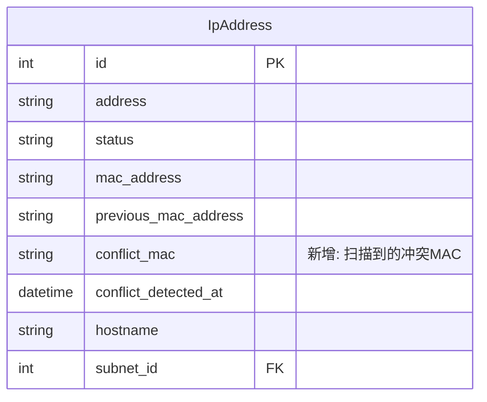

# feat: 完善 IP 冲突解决功能

## Overview

IP 列表页面的冲突解决按钮显示"功能开发中"，但后端服务和 API 已经实现。需要：
1. 连接前端到已有后端
2. 修复数据模型和业务逻辑 Bug
3. 统一前后端参数

## Problem Statement / Motivation

用户在 IP 管理界面看到冲突状态的 IP，点击扳手图标时显示"功能开发中"，无法解决冲突。但 IP 详情页已有完整实现，造成功能不一致的用户体验。

**当前状态：**
- ✅ 后端服务层：`ConflictDetectionService.resolve_conflict()` 已实现
- ✅ API 端点：`/api/ip-addresses/resolve_conflict/` 已存在
- ✅ IP 详情页：`ip_detail.html` 有完整解决界面
- ❌ IP 列表页：`ip_list.html` 显示"功能开发中"
- ❌ 前后端参数不匹配（action vs resolution）
- ❌ `update_mac` 业务逻辑未正确实现

## Proposed Solution

### 阶段 1：修复关键 Bug（优先）

1. **修复前后端参数不匹配**
   - 前端使用 `action: 'keep'/'update'/'release'`
   - 后端期望 `resolution: 'keep_current'/'update_mac'/'release'`
   - 统一为后端格式

2. **修复 `update_mac` 业务逻辑**
   - 当前代码未实际更新 MAC 地址
   - 需要从审计日志或新字段获取扫描到的 MAC

3. **添加 `conflict_mac` 字段**（可选但推荐）
   - 存储扫描检测到的冲突 MAC 地址
   - 便于前端显示和 `update_mac` 操作

### 阶段 2：完善列表页功能

4. **实现 IP 列表页冲突解决**
   - 复用详情页的模态框逻辑
   - 或直接跳转到详情页

## Technical Considerations

### 涉及文件

```
后端：
├── backend/ipam/models.py           # 添加 conflict_mac 字段
├── backend/ipam/services.py         # 修复 resolve_conflict 逻辑
├── backend/ipam/views.py            # API 参数处理
└── backend/ipam/migrations/         # 新迁移文件

前端：
├── backend/templates/ipam/ip_list.html    # 主要修改
└── backend/templates/ipam/ip_detail.html  # 参数名修复
```

### 数据流

```
用户点击扳手图标
    ↓
显示冲突解决模态框
  - 当前 MAC: {{ ip.mac_address }}
  - 扫描 MAC: {{ ip.conflict_mac }} 或从 previous_mac_address 推断
    ↓
用户选择解决方案
  - keep_current: 保留当前配置
  - update_mac: 更新为扫描 MAC
  - release: 释放 IP
    ↓
POST /api/ip-addresses/{id}/resolve_conflict/
Body: { "resolution": "keep_current|update_mac|release" }
    ↓
刷新页面显示结果
```

## Acceptance Criteria

### 功能需求
- [ ] IP 列表页点击扳手图标可解决冲突
- [ ] 支持三种解决方案：保留当前/更新MAC/释放IP
- [ ] 解决后正确更新 IP 状态
- [ ] 记录完整的审计日志

### 技术需求
- [ ] 前后端参数名称统一
- [ ] `update_mac` 正确更新 MAC 地址
- [ ] API 返回一致的响应格式
- [ ] 错误情况有友好提示

### 测试用例
- [ ] 从列表页解决冲突 - 三种方案都测试
- [ ] 从详情页解决冲突 - 确保未破坏现有功能
- [ ] 非冲突状态的 IP 调用 API 返回错误
- [ ] 并发解决同一冲突的处理

## Implementation Plan

### Step 1: 修复前后端参数不匹配

**文件**: `backend/templates/ipam/ip_detail.html`

```javascript
// 修改前 (约第 302-305 行)
body: JSON.stringify({ action: action })

// 修改后
const resolutionMap = {
    'keep': 'keep_current',
    'update': 'update_mac',
    'release': 'release'
};
body: JSON.stringify({
    resolution: resolutionMap[action],
    scanned_mac: '{{ ip.previous_mac_address }}'  // update_mac 时需要
})
```

### Step 2: 修复 update_mac 业务逻辑

**文件**: `backend/ipam/services.py`

```python
# 修改 resolve_conflict 方法 (约第 380-390 行)
elif resolution == "update_mac":
    # 从请求参数获取扫描到的 MAC
    if not scanned_mac:
        raise ValidationError("update_mac 需要提供 scanned_mac 参数")

    ip.previous_mac_address = ip.mac_address  # 保存旧 MAC
    ip.mac_address = scanned_mac              # 更新为新 MAC
    ip.status = "allocated"
    ip.conflict_detected_at = None
```

### Step 3: 修复 API 视图接收参数

**文件**: `backend/ipam/views.py`

```python
# 修改 resolve_conflict action (约第 250 行)
@action(detail=True, methods=["post"], url_path="resolve-conflict")
def resolve_conflict(self, request: Request, pk=None) -> Response:
    ip = self.get_object()
    resolution = request.data.get("resolution", "keep_current")
    scanned_mac = request.data.get("scanned_mac")

    try:
        result = ConflictDetectionService.resolve_conflict(
            ip_id=ip.id,
            user=request.user,
            resolution=resolution,
            scanned_mac=scanned_mac
        )
        return Response({
            "status": "success",
            "message": f"冲突已解决: {ip.address}",
            "data": IpAddressSerializer(result).data
        })
    except ValidationError as e:
        return Response({"status": "error", "message": str(e)}, status=400)
```

### Step 4: 实现列表页冲突解决功能

**文件**: `backend/templates/ipam/ip_list.html`

```javascript
// 替换原有的 resolveConflict 函数 (约第 281-287 行)
async function resolveConflict(ipId) {
    // 获取 IP 信息用于显示
    const ipRow = document.querySelector(`tr[data-ip-id="${ipId}"]`);
    const currentMac = ipRow?.dataset.mac || '未知';
    const previousMac = ipRow?.dataset.previousMac || '未知';
    const ipAddress = ipRow?.dataset.address || ipId;

    // 显示解决方案选择对话框
    const html = `
        <div class="p-6 space-y-4">
            <div class="bg-amber-50 dark:bg-amber-900/20 border border-amber-200 dark:border-amber-800 rounded-lg p-4">
                <p class="text-sm font-medium text-amber-900 dark:text-amber-200">MAC 地址冲突</p>
                <div class="mt-2 text-sm text-amber-700 dark:text-amber-300">
                    <p>当前 MAC: <code class="font-mono">${currentMac}</code></p>
                    <p>扫描 MAC: <code class="font-mono">${previousMac}</code></p>
                </div>
            </div>

            <div class="space-y-2">
                <label class="flex items-center gap-2">
                    <input type="radio" name="resolution" value="keep_current" checked>
                    <span>保留当前 MAC 地址</span>
                </label>
                <label class="flex items-center gap-2">
                    <input type="radio" name="resolution" value="update_mac">
                    <span>更新为扫描到的 MAC</span>
                </label>
                <label class="flex items-center gap-2">
                    <input type="radio" name="resolution" value="release">
                    <span class="text-red-600">释放此 IP 地址</span>
                </label>
            </div>
        </div>
    `;

    // 使用自定义确认框
    const confirmed = await window.modal.confirm({
        title: `解决冲突: ${ipAddress}`,
        message: html,
        confirmText: '确定',
        cancelText: '取消',
        danger: false
    });

    if (!confirmed) return;

    const resolution = document.querySelector('input[name="resolution"]:checked')?.value || 'keep_current';

    try {
        const data = await window.apiFetch(`/api/ip-addresses/${ipId}/resolve-conflict/`, {
            method: 'POST',
            body: JSON.stringify({
                resolution: resolution,
                scanned_mac: previousMac
            })
        });

        window.modal.toast('冲突已解决', 'success');
        setTimeout(() => location.reload(), 1000);

    } catch (error) {
        window.modal.toast('解决失败: ' + error.message, 'error');
    }
}
```

### Step 5: 添加数据属性到表格行

**文件**: `backend/templates/ipam/ip_list.html`

```html
<!-- 修改表格行，添加数据属性 -->
<tr data-ip-id="{{ ip.id }}"
    data-mac="{{ ip.mac_address }}"
    data-previous-mac="{{ ip.previous_mac_address }}"
    data-address="{{ ip.address }}"
    class="ip-row ...">
```

## Success Metrics

- 冲突解决成功率 100%（三种方案都能正常工作）
- 用户无需跳转详情页即可在列表页解决冲突
- 审计日志完整记录解决操作

## Dependencies & Risks

### 依赖
- 现有的 `ConflictDetectionService` 服务
- 现有的 `window.modal` 弹窗组件
- 现有的 `window.apiFetch` 请求函数

### 风险
- **低风险**：参数修改可能影响其他调用点
  - 缓解：全局搜索确认所有调用点
- **低风险**：API URL 变更（resolve_conflict → resolve-conflict）
  - 缓解：同时支持两种 URL 或一次性修改

## References & Research

### 内部文件
- `backend/ipam/services.py:354-412` - ConflictDetectionService.resolve_conflict()
- `backend/ipam/views.py:243-266` - API 端点
- `backend/templates/ipam/ip_detail.html:283-316` - 详情页实现
- `backend/templates/ipam/ip_list.html:281-287` - 需修改位置

### 最佳实践
- [Infoblox IPAM 冲突处理](https://docs.infoblox.com/display/nios85/Conflict+Resolution+in+Network+Insight)
- [SolarWinds 冲突解决 UI](https://www.solarwinds.com/ip-address-manager/use-cases/ip-address-conflict)

## ERD 变更（可选）

如果添加 `conflict_mac` 字段：



---

**预计工作量**: 2-3 小时
**优先级**: P1（用户可见的功能缺失）
