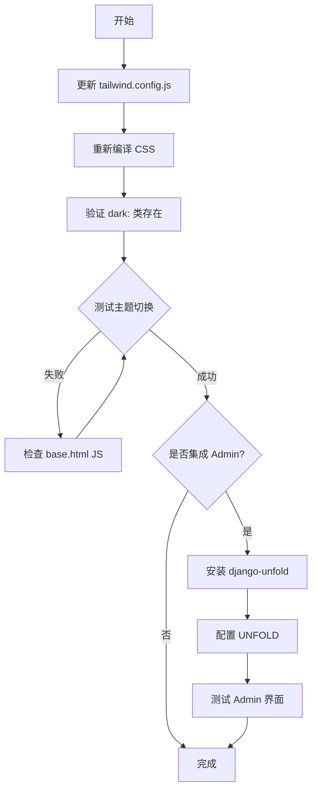

# fix: 修复主题切换功能并优化系统集成

**日期**: 2026-01-04
**类型**: Bug Fix + Enhancement
**优先级**: 高

## 概述

用户反馈主题切换功能不生效（一直显示亮色模式），同时询问 Django Admin 是否能与系统风格融合。经调查发现：

1. **主题切换失效原因**：Tailwind CSS 配置文件缺少 `darkMode: 'class'` 设置，导致所有 `dark:` 前缀的样式类没有被编译到最终 CSS 中
2. **功能完成度**：项目功能已 98% 完成，所有核心功能均已实现
3. **Django Admin 集成**：需要决定是否将 Admin 样式与系统主题统一

## 问题分析

### 1. 主题切换失效（关键问题）

**根因**：`/opt/ipim/frontend/tailwind.config.js` 缺少 darkMode 配置

```javascript
// 当前配置（缺少 darkMode）
module.exports = {
  content: [...],
  theme: { extend: {...} },
  plugins: [],
}
```

**验证**：
```bash
# 检查 CSS 中 dark: 前缀的数量
grep -c "dark:" /opt/ipim/backend/static/css/tailwind.css
# 结果: 0 （应该有数百个）
```

**影响**：
- base.html 中的主题切换按钮和 JavaScript 逻辑正常
- 所有模板中的 `dark:bg-*`、`dark:text-*` 等类都被忽略
- 用户看到的永远是亮色模式

### 2. Django Admin 样式问题

当前状态：
- Django Admin 使用默认样式，与系统暗色主题不协调
- Admin 入口在侧边栏底部（仅管理员可见）

可选方案：
| 方案 | 复杂度 | 效果 | 推荐度 |
|-----|-------|-----|-------|
| A. 使用 django-unfold | 低 | 现代化暗色主题 | ★★★★★ |
| B. 使用 django-jazzmin | 低 | 多种主题可选 | ★★★★☆ |
| C. 完全自定义 CSS | 高 | 完美匹配系统 | ★★☆☆☆ |
| D. 保持现状 | 无 | 功能正常但不协调 | ★★★☆☆ |

## 解决方案

### Phase 1: 修复主题切换（必须）

#### 1.1 更新 Tailwind 配置

**文件**: `/opt/ipim/frontend/tailwind.config.js`

```javascript
/** @type {import('tailwindcss').Config} */
module.exports = {
  darkMode: 'class',  // 添加这一行
  content: [
    "../backend/templates/**/*.html",
    "../backend/ipam/templates/**/*.html",
    "./src/**/*.js",
  ],
  theme: {
    extend: {
      // ... 现有配置保持不变
    },
  },
  plugins: [],
}
```

#### 1.2 重新编译 Tailwind CSS

```bash
cd /opt/ipim/frontend
npm run build:css
# 或者
npx tailwindcss -i ./src/input.css -o ../backend/static/css/tailwind.css --minify
```

#### 1.3 验证修复

```bash
# 检查新 CSS 文件中的 dark: 类
grep -c "dark:" /opt/ipim/backend/static/css/tailwind.css
# 预期结果: 500+ （大量 dark: 前缀类）
```

### Phase 2: Django Admin 主题集成（可选）

推荐使用 **django-unfold**，它提供：
- 现代化暗色主题
- 与 Tailwind CSS 兼容
- 响应式设计
- 自定义侧边栏

#### 2.1 安装 django-unfold

```bash
pip install django-unfold
```

#### 2.2 配置 settings.py

```python
INSTALLED_APPS = [
    "unfold",  # 添加在 django.contrib.admin 之前
    "unfold.contrib.filters",
    "unfold.contrib.forms",
    "django.contrib.admin",
    # ... 其他应用
]

# Unfold 配置
UNFOLD = {
    "SITE_TITLE": "IPAM 管理后台",
    "SITE_HEADER": "中创新航 IP 地址管理系统",
    "SITE_SYMBOL": "router",
    "SHOW_HISTORY": True,
    "SHOW_VIEW_ON_SITE": True,
    "THEME": "dark",  # 默认暗色主题
    "COLORS": {
        "primary": {
            "50": "#eff6ff",
            "100": "#dbeafe",
            "200": "#bfdbfe",
            "300": "#93c5fd",
            "400": "#60a5fa",
            "500": "#3b82f6",
            "600": "#2563eb",
            "700": "#1d4ed8",
            "800": "#1e40af",
            "900": "#1e3a8a",
            "950": "#172554",
        },
    },
    "SIDEBAR": {
        "show_search": True,
        "show_all_applications": False,
        "navigation": [
            {
                "title": "IP 管理",
                "items": [
                    {"title": "子网", "icon": "lan", "link": "/admin/ipam/subnet/"},
                    {"title": "IP 地址", "icon": "dns", "link": "/admin/ipam/ipaddress/"},
                ],
            },
            {
                "title": "设备管理",
                "items": [
                    {"title": "网络设备", "icon": "router", "link": "/admin/ipam/networkdevice/"},
                ],
            },
            {
                "title": "系统",
                "items": [
                    {"title": "审计日志", "icon": "history", "link": "/admin/ipam/auditlog/"},
                    {"title": "用户", "icon": "group", "link": "/admin/auth/user/"},
                ],
            },
        ],
    },
}
```

## 验收标准

### 功能要求

- [ ] 主题切换按钮点击后，页面立即切换主题
- [ ] 刷新页面后保持用户选择的主题
- [ ] 系统默认跟随用户系统偏好
- [ ] 所有页面在亮色/暗色模式下文字清晰可读
- [ ] （可选）Django Admin 使用暗色主题

### 测试用例

1. **主题切换测试**
   - 打开仪表板，点击顶部主题按钮
   - 预期：页面背景从白色变为深灰色（或反之）
   - 验证：侧边栏、卡片、表格等元素都正确切换

2. **主题持久化测试**
   - 选择暗色主题，刷新页面
   - 预期：页面保持暗色主题
   - 验证：`localStorage.getItem('theme')` 返回 'dark'

3. **系统偏好跟随测试**
   - 清除 localStorage 中的 theme 设置
   - 在系统设置中切换暗色/亮色模式
   - 刷新页面
   - 预期：页面主题跟随系统设置

## 实施步骤



## 文件变更清单

| 文件路径 | 操作 | 说明 |
|---------|-----|------|
| `/opt/ipim/frontend/tailwind.config.js` | 修改 | 添加 `darkMode: 'class'` |
| `/opt/ipim/backend/static/css/tailwind.css` | 重新生成 | 包含 dark: 前缀类 |
| `/opt/ipim/backend/requirements.txt` | 修改（可选） | 添加 django-unfold |
| `/opt/ipim/backend/ipam_project/settings.py` | 修改（可选） | 配置 UNFOLD |

## 风险评估

| 风险 | 影响 | 可能性 | 缓解措施 |
|-----|-----|-------|---------|
| CSS 编译后文件过大 | 低 | 中 | 使用 --minify 选项 |
| 主题切换闪烁 | 低 | 低 | 已在 base.html 中预防 |
| Admin 插件兼容性 | 中 | 低 | django-unfold 维护活跃 |

## 参考资料

- Tailwind CSS Dark Mode: https://tailwindcss.com/docs/dark-mode
- django-unfold: https://github.com/unfoldadmin/django-unfold
- 项目 base.html 主题切换逻辑: `/opt/ipim/backend/templates/base.html:27-93`
