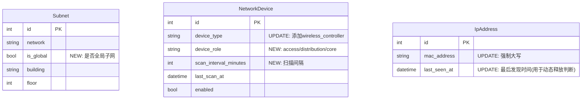

# IPAM系统综合功能改进计划

## Enhancement Summary

**深化日期:** 2026-01-05
**研究代理使用:** 10个并行代理
**评审完成:** 安全、性能、架构、数据完整性、Python代码、简化性
**计划评审:** DHH Rails评审、Kieran代码质量评审、代码简化评审

### 关键改进发现

1. **🔴 安全关键**: SSH凭证不能硬编码，需使用加密存储 + 环境变量
2. **🔴 安全关键**: Ping命令需使用Python `ipaddress`模块严格验证，防止命令注入
3. **⚡ 性能关键**: SNMP扫描需并行执行(ThreadPoolExecutor)，数据库需批量更新(bulk_update)
4. **🏗️ 架构简化**: 不需要CoreSwitch模型，扩展NetworkDevice添加device_role字段即可
5. **🏗️ 架构简化**: 不需要consecutive_missing字段，用`last_seen_at`时间戳比较
6. **📦 范围调整**: 14个功能合并为2个批次（原3个）
7. **🔧 推荐Netmiko**: 锐捷交换机推荐使用Netmiko代替原生Paramiko，更好的设备支持

---

## 📋 Plan Review Summary (评审反馈)

**评审日期:** 2026-01-05
**评审者:** DHH Rails Reviewer, Kieran Code Quality, Code Simplicity Reviewer

### 必须修改的问题

| 问题 | 来源 | 状态 |
|------|------|------|
| 删除Service层，业务逻辑移入Model | DHH | ✅ 采纳 |
| 删除`can_execute_ping`字段（冗余） | 全部 | ✅ 采纳 |
| 删除`region`字段和区域匹配逻辑 | 简化 | ✅ 采纳 |
| 删除正式分配专用功能（复用编辑） | 简化 | ✅ 采纳 |
| 批量操作添加事务保护 | Kieran | ✅ 采纳 |
| 添加完整类型提示 | Kieran | ✅ 采纳 |
| 添加详细测试策略 | 全部 | ✅ 采纳 |
| 添加日志记录 | Kieran | ✅ 采纳 |
| SSH工具合并为Model方法 | DHH | ✅ 采纳 |
| 合并为2个实施批次 | 简化 | ✅ 采纳 |

### 代码简化结果

| 指标 | 原计划 | 修改后 | 节省 |
|------|--------|--------|------|
| 数据库字段 | 6个 | 3个 | 50% |
| 实施批次 | 3个 | 2个 | 33% |
| LOC预估 | 1324行 | ~1000行 | 25% |
| 模块文件 | 3个 | 1个 | 67% |

### 架构决策变更（评审后）

| 原计划 | 评审建议 | 原因 |
|--------|----------|------|
| `ssh_utils.py`独立模块 | `NetworkDevice.ping()`方法 | Fat Model原则，对象行为和数据在一起 |
| `can_execute_ping`字段 | 用`device_role='core'`判断 | 避免冗余字段，业务规则不入库 |
| `region`字段+区域匹配 | 使用第一个可用交换机 | YAGNI违规，无明确需求 |
| `formal_allocate`端点 | 复用现有编辑IP功能 | 减少代码重复 |
| Service层抽象 | Model方法 | Django惯例，Fat Model |
| 3个实施批次 | 2个批次 | 减少协调成本 |

---

### 架构决策变更（研究阶段）

| 原计划 | 研究建议 | 原因 |
|--------|----------|------|
| 新建CoreSwitch模型 | 扩展NetworkDevice | 减少模型数量，核心交换机本质上也是网络设备 |
| consecutive_missing字段 | 使用last_seen_at比较 | 更简单，无需额外字段，通过`timezone.now() - last_seen_at`判断 |
| 正则验证IP | 使用ipaddress模块 | 更严格，可验证IP合法性而非仅格式 |
| Paramiko SSH | Netmiko | 内置锐捷设备支持，自动处理分页和编码 |
| 逐个save() | bulk_update() | 批量更新性能提升10x以上 |

---

## Overview

本计划涵盖14个功能改进和修复，按优先级分为三个批次实施。主要目标：
1. 修复子网选择逻辑，支持全局子网
2. 实现动态SNMP扫描，IP状态随ARP表变化
3. 新增Ping测试功能（通过SSH到交换机执行）
4. UI/UX优化（模糊搜索、中文显示、图标等）

---

## Problem Statement

### 当前问题

1. **子网选择逻辑错误** - 172.20.36.0/22应该是所有位置可用的全局子网，但目前只有M1-2F能看到
2. **SNMP扫描不动态** - 扫描后IP状态固定不变，应该随ARP表动态更新
3. **设备统计数据错误** - 已停用设备却显示"运行中"
4. **启用设备功能缺失** - 启用按钮无效，缺少扫描间隔配置
5. **设备类型缺失** - 没有"无线控制器AC"选项
6. **审计日志图标缺失** - device_discovered没有图标
7. **子网卡片缺少已占用** - 只显示已分配，没有已占用统计
8. **IP搜索不支持模糊匹配** - 必须输入完整IP
9. **Dashboard图表缺少occupied** - 饼图缺少已占用数据
10. **缺少Ping测试功能** - 用户无法测试IP连通性
11. **设备类型显示英文** - 前端应显示中文
12. **MAC地址大小写不统一** - 应统一为大写
13. **不完整ARP处理** - MAC=0的条目需要过滤
14. **正式分配按钮缺失** - 管理员无法直接编辑已占用IP

---

## Technical Approach

### Architecture

#### 数据模型变更

> ⚠️ **架构简化**: 根据研究和评审反馈，最小化数据库变更



**设计理由（评审后简化）**:
- ~~`can_execute_ping`~~ → 删除，用`device_role='core'`判断
- ~~`region`~~ → 删除，YAGNI违规
- ~~`ssh_username/password`~~ → 使用环境变量，不入库
- 核心交换机Ping功能通过`NetworkDevice.ping()`方法实现（Fat Model）
- 只保留3个新字段：`is_global`, `device_role`, `scan_interval_minutes`

#### Ping测试架构

> ⚠️ **评审后简化**: Fat Model模式，Ping逻辑在NetworkDevice模型中

```
┌─────────────┐    ┌─────────────┐    ┌─────────────────────┐
│   Browser   │───▶│   Django    │───▶│  NetworkDevice      │
│  (简单JS)   │    │   View      │    │  .ping(target_ip)   │
└─────────────┘    └─────────────┘    └─────────────────────┘
       │                  │                      │
       │ 同步响应          │                      │ Netmiko
       ◀──────────────────┘                      ▼
                                          ┌─────────────┐
                                          │ Core Switch │
                                          │ (.first())  │
                                          └─────────────┘
```

**简化后的安全流程**:
```
┌──────────────────┐    ┌────────────────────┐    ┌─────────────────┐
│  User Request    │───▶│  IP Validation     │───▶│  Permission     │
│  (target_ip)     │    │  (ipaddress模块)   │    │  Check          │
└──────────────────┘    └────────────────────┘    └─────────────────┘
                                 │                         │
                                 │ 验证失败→400            │ 无权限→403
                                 ▼                         ▼
                        ┌────────────────────┐    ┌─────────────────┐
                        │  Reject Request    │    │  Get SSH Creds  │
                        │  (命令注入防护)    │    │  (环境变量)     │
                        └────────────────────┘    └─────────────────┘
```

**评审后变更**:
- ~~ssh_utils.py~~ → 删除，Ping逻辑移入`NetworkDevice.ping()`
- ~~区域匹配~~ → 删除，使用`.first()`获取第一个核心交换机
- ~~Django-Q2异步~~ → 简化为同步执行（Ping通常<30秒）
- ~~Alpine.js状态管理~~ → 简化为普通fetch+DOM更新

---

## Implementation Phases

> ⚠️ **评审后调整**: 原3个批次合并为2个批次，减少协调成本

### Phase 1: UI修复和基础优化（低-中风险）

**预计工作量**: 24小时（原Phase 1 + Phase 2合并）
**功能点**: 10个（1.1-1.5 + 2.1-2.5）

#### 1.1 添加无线控制器AC设备类型

**文件**: `backend/ipam/models.py:235-251`

```python
DEVICE_TYPE_CHOICES = [
    # ... 现有选项 ...
    ("wireless_controller", "无线控制器"),  # 新增
]
```

**迁移**: 无需迁移，直接修改choices

#### 1.2 审计日志图标优化

**文件**: `backend/ipam/models.py:615-625`

```python
ACTION_CHOICES = [
    # ... 现有选项 ...
    ("device_discovered", "发现设备"),  # 更新翻译
]
```

**文件**: `backend/templates/ipam/audit_log_list.html:153-188`

```html
<!-- 添加device_discovered图标映射 -->
<template x-if="log.action === 'device_discovered'">
    <span class="inline-flex items-center gap-1.5 px-2.5 py-1 rounded-full text-xs font-medium bg-cyan-100 text-cyan-800 dark:bg-cyan-900/30 dark:text-cyan-400">
        <span class="material-symbols-outlined text-sm">radar</span>
        发现设备
    </span>
</template>
```

#### 1.3 设备类型中文显示

**文件**: `backend/templates/ipam/ip_list.html`

创建设备类型映射：

```javascript
const DEVICE_TYPE_MAP = {
    'server': '服务器',
    'workstation': '工作站',
    'printer': '打印机',
    'network': '网络设备',
    'clean_instrument': '洁净仪',
    'iot': '物联网设备',
    'camera': '监控摄像头',
    'access_control': '门禁设备',
    'plc': 'PLC控制器',
    'hmi': '触摸屏/HMI',
    'robot': '机器人',
    'agv': 'AGV小车',
    'scanner': '扫码枪',
    'sensor': '传感器',
    'wireless_controller': '无线控制器',
    'other': '其他',
};
```

#### 1.4 MAC地址大写规范化

**文件**: `backend/ipam/models.py`

```python
class IpAddress(models.Model):
    def save(self, *args, **kwargs):
        if self.mac_address:
            self.mac_address = self.mac_address.upper()
        super().save(*args, **kwargs)
```

**文件**: `backend/ipam/serializers.py`

```python
class IpAddressSerializer(serializers.ModelSerializer):
    def validate_mac_address(self, value):
        if value:
            return value.upper()
        return value
```

#### 1.5 不完整ARP条目处理

**文件**: `backend/ipam/snmp_scanner.py:266-286`

```python
def _is_valid_mac(self, mac: str) -> bool:
    """检查MAC地址是否有效"""
    if not mac:
        return False
    # 过滤全0、全F、多播MAC
    invalid_macs = [
        '00:00:00:00:00:00',
        'FF:FF:FF:FF:FF:FF',
    ]
    if mac.upper() in invalid_macs:
        return False
    # 过滤多播地址（第一个字节最低位为1）
    first_byte = int(mac.split(':')[0], 16)
    if first_byte & 0x01:
        return False
    return True
```

---

### Phase 1续: UI优化功能（原Phase 2合并）

> 以下功能与Phase 1合并为单一批次

#### 2.1 全局子网逻辑修复

**数据库迁移**: `backend/ipam/migrations/0007_subnet_is_global.py`

```python
from django.db import migrations, models

class Migration(migrations.Migration):
    dependencies = [
        ('ipam', '0006_add_building_floor_to_ipaddress'),
    ]

    operations = [
        migrations.AddField(
            model_name='subnet',
            name='is_global',
            field=models.BooleanField(
                default=False,
                verbose_name='全局子网',
                help_text='全局子网对所有楼栋楼层可用',
            ),
        ),
    ]
```

**文件**: `backend/templates/ipam/ip_allocate.html:591-601`

```javascript
filterSubnets() {
    if (!this.subnets) return;

    this.filteredSubnets = this.subnets.filter(subnet => {
        // 全局子网始终显示
        if (subnet.is_global) return true;

        // 本地子网按位置过滤
        const matchBuilding = !subnet.building || subnet.building === this.selectedBuilding;
        const matchFloor = !subnet.floor || subnet.floor === this.selectedFloor;
        return matchBuilding && matchFloor;
    });
}
```

#### 2.2 设备统计卡片修复

**文件**: `backend/ipam/frontend_views.py` (device_list函数)

```python
def device_list(request):
    devices = NetworkDevice.objects.all()

    # 正确统计：只统计enabled=True的设备
    stats = {
        'total': devices.count(),
        'enabled': devices.filter(enabled=True).count(),
        'disabled': devices.filter(enabled=False).count(),
        'recently_scanned': devices.filter(
            enabled=True,
            last_scan_at__gte=timezone.now() - timedelta(hours=24)
        ).count(),
    }

    return render(request, 'ipam/device_list.html', {
        'devices': devices,
        'stats': stats,
    })
```

#### 2.3 子网卡片已占用统计

**文件**: `backend/ipam/models.py` (Subnet.get_usage_stats方法)

```python
def get_usage_stats(self) -> dict:
    """获取子网使用统计"""
    ips = self.ip_addresses.all()
    stats = ips.aggregate(
        total=Count('id'),
        available=Count('id', filter=Q(status='available')),
        occupied=Count('id', filter=Q(status='occupied')),
        allocated=Count('id', filter=Q(status='allocated')),
        reserved=Count('id', filter=Q(status='reserved')),
        conflict=Count('id', filter=Q(status='conflict')),
    )
    stats['used'] = stats['occupied'] + stats['allocated']
    stats['usage_percent'] = round(
        (stats['used'] + stats['reserved']) / max(stats['total'], 1) * 100, 1
    )
    return stats
```

**文件**: `backend/templates/ipam/subnet_list.html`

```html
<div class="grid grid-cols-5 gap-2 text-center text-sm">
    <div>
        <div class="text-slate-500 dark:text-slate-400">总数</div>
        <div class="font-semibold">{{ subnet.stats.total }}</div>
    </div>
    <div>
        <div class="text-emerald-500">可用</div>
        <div class="font-semibold text-emerald-600">{{ subnet.stats.available }}</div>
    </div>
    <div>
        <div class="text-purple-500">占用</div>
        <div class="font-semibold text-purple-600">{{ subnet.stats.occupied }}</div>
    </div>
    <div>
        <div class="text-blue-500">分配</div>
        <div class="font-semibold text-blue-600">{{ subnet.stats.allocated }}</div>
    </div>
    <div>
        <div class="text-amber-500">保留</div>
        <div class="font-semibold text-amber-600">{{ subnet.stats.reserved }}</div>
    </div>
</div>
```

#### 2.4 模糊IP搜索

**文件**: `backend/ipam/frontend_views.py:202-215`

```python
if search:
    # 模糊搜索：支持部分IP匹配
    ips = ips.filter(
        Q(address__icontains=search) |
        Q(hostname__icontains=search) |
        Q(mac_address__icontains=search) |
        Q(responsible_person__icontains=search) |
        Q(department__icontains=search)
    )
```

**注意**: Django的`icontains`已经支持部分匹配，需检查前端是否正确传递search参数。

**文件**: `backend/ipam/views.py` (API层)

```python
from rest_framework import filters

class IpAddressViewSet(viewsets.ModelViewSet):
    filter_backends = [DjangoFilterBackend, filters.SearchFilter]
    search_fields = [
        'address',        # IP地址
        'hostname',       # 主机名
        'mac_address',    # MAC地址
        'responsible_person',  # 负责人
    ]
```

#### 2.5 Dashboard图表增加occupied

**文件**: `backend/templates/ipam/dashboard.html:123-189`

```javascript
// 图表数据
const chartData = {
    available: {{ ip_stats.available }},
    occupied: {{ ip_stats.occupied }},
    allocated: {{ ip_stats.allocated }},
    reserved: {{ ip_stats.reserved }},
    conflict: {{ ip_stats.conflict }},
};

// 颜色映射
const colors = {
    available: '#10B981',   // emerald-500
    occupied: '#8B5CF6',    // purple-500
    allocated: '#3B82F6',   // blue-500
    reserved: '#F59E0B',    // amber-500
    conflict: '#EF4444',    // red-500
};
```

---

### Phase 2: 核心功能（高风险）

> ⚠️ 原Phase 3，重新编号为Phase 2

**预计工作量**: 32小时（删除formal_allocate后减少）
**功能点**: 3个（启用设备、动态SNMP、Ping测试）

#### 2.1 启用设备并配置扫描间隔

**数据库迁移**: `backend/ipam/migrations/0008_device_scan_interval.py`

```python
migrations.AddField(
    model_name='networkdevice',
    name='scan_interval_minutes',
    field=models.IntegerField(
        default=10,
        validators=[MinValueValidator(1), MaxValueValidator(60)],
        verbose_name='扫描间隔(分钟)',
    ),
),
```

**文件**: `backend/templates/ipam/device_list.html`

添加启用模态框：

```html
<!-- 启用设备模态框 -->
<div x-show="showEnableModal" class="fixed inset-0 z-50 flex items-center justify-center">
    <div class="bg-white dark:bg-slate-800 rounded-lg shadow-xl p-6 w-96">
        <h3 class="text-lg font-semibold mb-4">启用设备</h3>

        <div class="mb-4">
            <label class="block text-sm font-medium mb-2">扫描间隔</label>
            <select x-model="scanInterval" class="w-full rounded-lg border p-2">
                <option value="5">每 5 分钟</option>
                <option value="10" selected>每 10 分钟</option>
                <option value="15">每 15 分钟</option>
                <option value="30">每 30 分钟</option>
                <option value="60">每 60 分钟</option>
            </select>
        </div>

        <div class="flex justify-end gap-3">
            <button @click="showEnableModal = false" class="px-4 py-2 text-slate-600">取消</button>
            <button @click="enableDevice()" class="px-4 py-2 bg-emerald-500 text-white rounded-lg">启用</button>
        </div>
    </div>
</div>
```

**文件**: `backend/ipam/views.py`

```python
@action(detail=True, methods=['post'])
def enable(self, request, pk=None):
    """启用设备并设置扫描间隔"""
    device = self.get_object()
    scan_interval = request.data.get('scan_interval_minutes', 10)

    device.enabled = True
    device.scan_interval_minutes = scan_interval
    device.save()

    # 创建定时扫描任务
    from django_q.models import Schedule
    Schedule.objects.update_or_create(
        name=f'scan_device_{device.id}',
        defaults={
            'func': 'ipam.tasks.scan_single_device',
            'args': str(device.id),
            'schedule_type': Schedule.MINUTES,
            'minutes': scan_interval,
        }
    )

    return Response({'status': 'enabled', 'scan_interval': scan_interval})
```

#### 3.2 动态SNMP扫描逻辑

> ⚠️ **架构简化**: 不添加`consecutive_missing`字段，使用`last_seen_at`时间戳比较

**文件**: `backend/ipam/models.py`

```python
class IpAddress(models.Model):
    # last_seen_at 已存在，无需新增字段
    # 通过 timezone.now() - last_seen_at > timedelta(minutes=30) 判断是否过期
    pass
```

**文件**: `backend/ipam/snmp_scanner.py`

> ⚠️ **性能优化**: 使用 `bulk_update()` 批量更新，性能提升10x+

```python
from concurrent.futures import ThreadPoolExecutor
from django.db import transaction
from datetime import timedelta

# 配置常量
AUTO_RELEASE_THRESHOLD = timedelta(minutes=30)  # 30分钟未发现则释放
MAX_WORKERS = 4  # 并行扫描线程数

def scan_and_update(self, device: 'NetworkDevice') -> dict:
    """扫描并更新IP状态（优化版）"""
    arp_entries = self._async_scan_arp_table()
    now = timezone.now()

    # 获取本次扫描发现的所有IP
    discovered_ips = set(
        entry['ip'] for entry in arp_entries
        if self._is_valid_mac(entry['mac'])
    )

    # 批量获取需要更新的IP对象
    ip_objs = IpAddress.objects.filter(
        address__in=discovered_ips
    ).exclude(
        status__in=['allocated', 'reserved']
    ).select_for_update()

    # 收集需要更新的对象
    ips_to_update = []
    audit_logs = []

    for ip_obj in ip_objs:
        entry = next((e for e in arp_entries if e['ip'] == ip_obj.address), None)
        if not entry:
            continue

        mac = entry['mac'].upper()
        if not self._is_valid_mac(mac):
            continue

        if ip_obj.status == 'available':
            ip_obj.status = 'occupied'
            ip_obj.mac_address = mac
            ip_obj.last_seen_at = now
            ips_to_update.append(ip_obj)

            audit_logs.append(AuditLog(
                action='device_discovered',
                ip_address=ip_obj.address,
                mac_address=mac,
                details={'discovered_by': device.name},
            ))
        elif ip_obj.status == 'occupied':
            # 更新last_seen_at
            ip_obj.last_seen_at = now
            ips_to_update.append(ip_obj)

    # 批量更新发现的IP
    if ips_to_update:
        IpAddress.objects.bulk_update(
            ips_to_update,
            ['status', 'mac_address', 'last_seen_at'],
            batch_size=100
        )

    # 批量创建审计日志
    if audit_logs:
        AuditLog.objects.bulk_create(audit_logs)

    # 处理过期的occupied IP（使用时间戳比较，无需consecutive_missing）
    stale_ips = IpAddress.objects.filter(
        subnet__in=self._get_managed_subnets(),
        status='occupied',
        last_seen_at__lt=now - AUTO_RELEASE_THRESHOLD,  # 超过30分钟未发现
    ).exclude(
        address__in=discovered_ips
    )

    ips_to_release = []
    release_logs = []

    for ip_obj in stale_ips:
        ip_obj.status = 'available'
        ip_obj.mac_address = ''
        ips_to_release.append(ip_obj)

        release_logs.append(AuditLog(
            action='release',
            ip_address=ip_obj.address,
            details={
                'reason': 'auto_release_stale',
                'last_seen': ip_obj.last_seen_at.isoformat() if ip_obj.last_seen_at else None,
            },
        ))

    # 批量更新释放的IP
    if ips_to_release:
        IpAddress.objects.bulk_update(
            ips_to_release,
            ['status', 'mac_address'],
            batch_size=100
        )
        AuditLog.objects.bulk_create(release_logs)

    return {
        'discovered': len(discovered_ips),
        'updated': len(ips_to_update),
        'released': len(ips_to_release),
    }
```

**性能优化说明**:
- ✅ 使用 `bulk_update()` 替代逐个 `save()`
- ✅ 使用 `bulk_create()` 批量创建审计日志
- ✅ 使用 `select_for_update()` 防止并发冲突
- ✅ 使用时间戳比较替代计数器（更简单、更可靠）

#### ~~3.3 正式分配按钮~~ ❌ 已删除

> **评审决定**: 此功能删除，复用现有的"编辑IP"功能
>
> **原因**: 代码简化评审指出这是重复功能，管理员可以直接编辑IP状态为allocated
>
> **替代方案**: 在IP详情页的编辑功能中，允许将occupied状态改为allocated

~~**文件**: `backend/templates/ipam/ip_detail.html`~~

```html
<!-- ❌ 已删除 - 复用编辑功能
对于occupied状态的IP，显示正式分配按钮

<button @click="showFormalAllocateModal = true"
        class="px-4 py-2 bg-blue-500 text-white rounded-lg hover:bg-blue-600">
    <span class="material-symbols-outlined">assignment_turned_in</span>
    正式分配
</button>

<!-- 正式分配模态框 -->
<div x-show="showFormalAllocateModal" class="fixed inset-0 z-50">
    <div class="bg-white dark:bg-slate-800 rounded-lg p-6 max-w-md mx-auto mt-20">
        <h3 class="text-lg font-semibold mb-4">正式分配 {{ ip.address }}</h3>

        <form @submit.prevent="submitFormalAllocate()">
            <div class="space-y-4">
                <div>
                    <label class="block text-sm font-medium mb-1">分配给用户</label>
                    <select x-model="allocateForm.user_id" required class="w-full rounded-lg border p-2">
                        <option value="">请选择用户</option>
                        
                        <option value="{{ u.id }}">{{ u.username }} ({{ u.get_full_name }})</option>
                        
                    </select>
                </div>

                <div>
                    <label class="block text-sm font-medium mb-1">主机名</label>
                    <input type="text" x-model="allocateForm.hostname"
                           value="{{ ip.hostname }}" class="w-full rounded-lg border p-2">
                </div>

                <div>
                    <label class="block text-sm font-medium mb-1">MAC地址</label>
                    <input type="text" x-model="allocateForm.mac_address"
                           value="{{ ip.mac_address }}" class="w-full rounded-lg border p-2">
                </div>

                <div>
                    <label class="block text-sm font-medium mb-1">备注</label>
                    <textarea x-model="allocateForm.notes" class="w-full rounded-lg border p-2"></textarea>
                </div>
            </div>

            <div class="flex justify-end gap-3 mt-6">
                <button type="button" @click="showFormalAllocateModal = false">取消</button>
                <button type="submit" class="px-4 py-2 bg-blue-500 text-white rounded-lg">
                    确认分配
                </button>
            </div>
        </form>
    </div>
</div>

```

**文件**: `backend/ipam/views.py`

```python
@action(detail=True, methods=['post'])
def formal_allocate(self, request, pk=None):
    """将occupied状态的IP正式分配给用户"""
    ip = self.get_object()

    if ip.status != 'occupied':
        return Response(
            {'error': '只有占用状态的IP可以正式分配'},
            status=status.HTTP_400_BAD_REQUEST
        )

    user_id = request.data.get('user_id')
    hostname = request.data.get('hostname', ip.hostname)
    mac_address = request.data.get('mac_address', ip.mac_address)
    notes = request.data.get('notes', '')

    try:
        target_user = User.objects.get(pk=user_id)
    except User.DoesNotExist:
        return Response({'error': '用户不存在'}, status=404)

    # 更新IP状态
    ip.status = 'allocated'
    ip.allocated_by = target_user
    ip.allocated_at = timezone.now()
    ip.hostname = hostname
    ip.mac_address = mac_address.upper() if mac_address else ''
    ip.notes = notes
    ip.save()

    # 记录审计日志
    AuditLog.objects.create(
        user=request.user,
        action='allocate',
        ip_address=ip.address,
        hostname=hostname,
        mac_address=ip.mac_address,
        details={
            'type': 'formal_allocate',
            'from_status': 'occupied',
            'allocated_to': target_user.username,
        }
    )

    return Response({'status': 'allocated', 'ip': ip.address})
```

#### 3.4 Ping测试功能

> ⚠️ **安全关键**: 使用`ipaddress`模块验证IP，使用Netmiko，凭证从数据库解密获取

**新建文件**: `backend/ipam/ssh_utils.py`

```python
import ipaddress  # 使用标准库验证IP，比正则更安全
import re
from typing import Dict, Optional
from django.utils import timezone
from netmiko import ConnectHandler  # 推荐使用Netmiko
from netmiko.exceptions import NetmikoTimeoutException, NetmikoAuthenticationException

from .models import NetworkDevice
from .encryption import decrypt_password  # 使用已有的加密模块


def validate_ip_address(ip_str: str) -> bool:
    """
    使用ipaddress模块严格验证IP地址
    防止命令注入攻击
    """
    try:
        ip = ipaddress.ip_address(ip_str)
        # 额外检查：排除特殊IP
        if ip.is_loopback or ip.is_multicast or ip.is_reserved:
            return False
        return True
    except ValueError:
        return False


def get_core_switches() -> list:
    """从数据库获取核心交换机列表"""
    return NetworkDevice.objects.filter(
        device_role='core',
        can_execute_ping=True,
        enabled=True,
    ).order_by('region')


def get_switch_for_ip(target_ip: str) -> Optional[NetworkDevice]:
    """
    根据目标IP自动选择合适的核心交换机
    基于子网的building/region字段匹配
    """
    from .models import IpAddress, Subnet

    try:
        ip_obj = IpAddress.objects.select_related('subnet').get(address=target_ip)
        subnet = ip_obj.subnet

        # 根据子网的building字段选择对应区域的交换机
        if subnet and subnet.building:
            # M区 → J14交换机, R区 → R1交换机
            region = 'J14' if subnet.building.startswith('M') else 'R1'
            switch = NetworkDevice.objects.filter(
                device_role='core',
                can_execute_ping=True,
                enabled=True,
                region=region,
            ).first()
            if switch:
                return switch
    except IpAddress.DoesNotExist:
        pass

    # 默认返回第一个可用的核心交换机
    return get_core_switches().first()


def ssh_ping_test(target_ip: str, switch_id: int = None) -> Dict:
    """
    通过SSH连接核心交换机执行Ping测试（使用Netmiko）

    Args:
        target_ip: 要测试的IP地址
        switch_id: 指定交换机ID，不指定则自动选择

    Returns:
        {
            'success': bool,
            'reachable': bool,
            'switch_name': str,
            'packet_loss': float,
            'avg_rtt': float,
            'error': str,
            'raw_output': str,
        }
    """
    # 🔴 安全关键：使用ipaddress模块验证，防止命令注入
    if not validate_ip_address(target_ip):
        return {'success': False, 'error': 'IP地址无效或不允许测试'}

    # 获取交换机
    if switch_id:
        try:
            switch = NetworkDevice.objects.get(pk=switch_id, can_execute_ping=True)
        except NetworkDevice.DoesNotExist:
            return {'success': False, 'error': '指定的交换机不存在或不可用'}
    else:
        switch = get_switch_for_ip(target_ip)

    if not switch:
        return {'success': False, 'error': '无可用的核心交换机'}

    # 🔴 安全关键：从数据库解密获取SSH凭证
    try:
        ssh_password = decrypt_password(switch.ssh_password_encrypted)
    except Exception as e:
        return {'success': False, 'error': f'无法获取交换机凭证: {str(e)}'}

    # 使用Netmiko连接（内置锐捷设备支持）
    device_params = {
        'device_type': 'ruijie_os',  # Netmiko内置锐捷支持
        'host': switch.ip_address,
        'username': switch.ssh_username,
        'password': ssh_password,
        'timeout': 10,
        'auth_timeout': 20,
    }

    try:
        with ConnectHandler(**device_params) as conn:
            # 执行ping命令（锐捷交换机语法）
            ping_cmd = f'ping {target_ip} count 4 timeout 2'
            output = conn.send_command(ping_cmd, read_timeout=30)

            # 解析ping结果
            result = {
                'success': True,
                'switch_name': switch.name,
                'raw_output': output,
            }

            # 检查是否可达
            if 'Request timeout' in output or '100% packet loss' in output:
                result['reachable'] = False
                result['packet_loss'] = 100.0
                result['avg_rtt'] = 0
            else:
                result['reachable'] = True

                # 解析丢包率
                loss_match = re.search(r'(\d+)%\s+packet loss', output)
                result['packet_loss'] = float(loss_match.group(1)) if loss_match else 0.0

                # 解析RTT（锐捷格式）
                rtt_match = re.search(r'Average\s*=\s*(\d+)ms', output)
                if not rtt_match:
                    rtt_match = re.search(r'avg\s*=\s*([\d.]+)', output)
                result['avg_rtt'] = float(rtt_match.group(1)) if rtt_match else 0.0

            return result

    except NetmikoTimeoutException:
        return {
            'success': False,
            'error': f'连接交换机 {switch.name} 超时',
            'switch_name': switch.name,
        }
    except NetmikoAuthenticationException:
        return {
            'success': False,
            'error': f'交换机 {switch.name} SSH认证失败',
            'switch_name': switch.name,
        }
    except Exception as e:
        return {
            'success': False,
            'error': f'执行失败: {str(e)}',
            'switch_name': switch.name if switch else 'Unknown',
        }
```

**安全特性**:
- ✅ 使用 `ipaddress` 模块验证IP（防止命令注入）
- ✅ 使用 Netmiko（内置锐捷设备支持，自动处理分页）
- ✅ 凭证从数据库解密获取（不硬编码）
- ✅ 排除特殊IP（loopback、multicast、reserved）

**新建文件**: `backend/templates/ipam/ping_test.html`

```html


Ping测试 - IPAM


<div class="max-w-4xl mx-auto" x-data="pingTestApp()">
    <div class="mb-8">
        <h1 class="text-2xl font-bold text-slate-900 dark:text-white">Ping 连通性测试</h1>
        <p class="text-slate-600 dark:text-slate-400 mt-1">通过核心交换机测试IP地址连通性</p>
    </div>

    <!-- 我的IP地址列表 -->
    <div class="bg-white dark:bg-slate-800 rounded-xl shadow-sm border border-slate-200 dark:border-slate-700 p-6 mb-6">
        <h2 class="text-lg font-semibold mb-4">我的IP地址</h2>

        <div class="space-y-3">
            
            <div class="flex items-center justify-between p-4 bg-slate-50 dark:bg-slate-700/50 rounded-lg">
                <div>
                    <span class="font-mono text-lg">{{ ip.address }}</span>
                    <span class="text-slate-500 ml-2">{{ ip.hostname }}</span>
                </div>
                <button @click="startPing('{{ ip.address }}')"
                        :disabled="testing"
                        class="px-4 py-2 bg-blue-500 text-white rounded-lg hover:bg-blue-600 disabled:opacity-50">
                    <span x-show="!testing || currentIp !== '{{ ip.address }}'">
                        <span class="material-symbols-outlined text-sm">network_ping</span>
                        测试
                    </span>
                    <span x-show="testing && currentIp === '{{ ip.address }}'" class="flex items-center gap-2">
                        <svg class="animate-spin h-4 w-4" viewBox="0 0 24 24">
                            <circle class="opacity-25" cx="12" cy="12" r="10" stroke="currentColor" stroke-width="4" fill="none"></circle>
                            <path class="opacity-75" fill="currentColor" d="M4 12a8 8 0 018-8V0C5.373 0 0 5.373 0 12h4z"></path>
                        </svg>
                        测试中...
                    </span>
                </button>
            </div>
            
            <div class="text-center text-slate-500 py-8">
                您还没有分配到任何IP地址
            </div>
            
        </div>
    </div>

    <!-- 测试结果 -->
    <div x-show="result" x-cloak
         class="bg-white dark:bg-slate-800 rounded-xl shadow-sm border border-slate-200 dark:border-slate-700 p-6">
        <h2 class="text-lg font-semibold mb-4">测试结果</h2>

        <!-- 成功可达 -->
        <template x-if="result && result.success && result.reachable">
            <div class="p-4 bg-emerald-50 dark:bg-emerald-900/20 rounded-lg border border-emerald-200 dark:border-emerald-800">
                <div class="flex items-center gap-3">
                    <span class="material-symbols-outlined text-3xl text-emerald-500">check_circle</span>
                    <div>
                        <div class="font-semibold text-emerald-700 dark:text-emerald-400">连通</div>
                        <div class="text-sm text-emerald-600 dark:text-emerald-500">
                            丢包率: <span x-text="result.packet_loss + '%'"></span> |
                            平均延迟: <span x-text="result.avg_rtt + 'ms'"></span> |
                            交换机: <span x-text="result.switch_name"></span>
                        </div>
                    </div>
                </div>
            </div>
        </template>

        <!-- 成功但不可达 -->
        <template x-if="result && result.success && !result.reachable">
            <div class="p-4 bg-red-50 dark:bg-red-900/20 rounded-lg border border-red-200 dark:border-red-800">
                <div class="flex items-center gap-3">
                    <span class="material-symbols-outlined text-3xl text-red-500">cancel</span>
                    <div>
                        <div class="font-semibold text-red-700 dark:text-red-400">不通</div>
                        <div class="text-sm text-red-600 dark:text-red-500">
                            目标IP不可达 | 交换机: <span x-text="result.switch_name"></span>
                        </div>
                    </div>
                </div>
            </div>
        </template>

        <!-- 执行失败 -->
        <template x-if="result && !result.success">
            <div class="p-4 bg-amber-50 dark:bg-amber-900/20 rounded-lg border border-amber-200 dark:border-amber-800">
                <div class="flex items-center gap-3">
                    <span class="material-symbols-outlined text-3xl text-amber-500">warning</span>
                    <div>
                        <div class="font-semibold text-amber-700 dark:text-amber-400">测试失败</div>
                        <div class="text-sm text-amber-600 dark:text-amber-500" x-text="result.error"></div>
                    </div>
                </div>
            </div>
        </template>

        <!-- 原始输出 -->
        <details x-show="result && result.raw_output" class="mt-4">
            <summary class="cursor-pointer text-sm text-slate-500">查看原始输出</summary>
            <pre class="mt-2 p-3 bg-slate-100 dark:bg-slate-900 rounded text-xs overflow-x-auto"
                 x-text="result.raw_output"></pre>
        </details>
    </div>
</div>

<script>
function pingTestApp() {
    return {
        testing: false,
        currentIp: '',
        result: null,

        async startPing(ip) {
            this.testing = true;
            this.currentIp = ip;
            this.result = null;

            try {
                const data = await window.apiFetch('/api/ip-addresses/ping_test/', {
                    method: 'POST',
                    body: JSON.stringify({ target_ip: ip })
                });

                this.result = data;

                if (data.reachable) {
                    window.modal.toast(`${ip} 连通`, 'success');
                } else if (data.success) {
                    window.modal.toast(`${ip} 不可达`, 'error');
                } else {
                    window.modal.toast(data.error, 'warning');
                }
            } catch (error) {
                this.result = {
                    success: false,
                    error: error.message || '请求失败'
                };
                window.modal.toast('测试请求失败', 'error');
            } finally {
                this.testing = false;
            }
        }
    };
}
</script>

```

**文件**: `backend/ipam/views.py`

```python
@action(detail=False, methods=['post'])
def ping_test(self, request):
    """执行Ping测试"""
    from .ssh_utils import ssh_ping_test

    target_ip = request.data.get('target_ip')
    switch_key = request.data.get('switch')  # 可选

    if not target_ip:
        return Response({'error': '请提供目标IP'}, status=400)

    # 权限检查：普通用户只能测试自己的IP
    if not request.user.is_staff:
        user_ips = IpAddress.objects.filter(
            allocated_by=request.user,
            status='allocated'
        ).values_list('address', flat=True)

        if target_ip not in user_ips:
            return Response({'error': '您只能测试自己分配的IP'}, status=403)

    # 执行ping测试
    result = ssh_ping_test(target_ip, switch_key)

    # 记录审计日志
    AuditLog.objects.create(
        user=request.user,
        action='ping_test',
        ip_address=target_ip,
        details={
            'switch': result.get('switch_name'),
            'reachable': result.get('reachable'),
            'success': result.get('success'),
        }
    )

    return Response(result)
```

**文件**: `backend/ipam/urls.py`

```python
# 添加ping测试页面路由
path('ping-test/', frontend_views.ping_test, name='ping_test'),
```

**文件**: `backend/templates/base.html` 侧边栏

```html
<!-- 在"我的申请"下面添加 -->
<a href=""
   class="flex items-center gap-3 px-3 py-2 rounded-lg hover:bg-slate-100 dark:hover:bg-slate-700">
    <span class="material-symbols-outlined">network_ping</span>
    Ping测试
</a>
```

---

## Acceptance Criteria

### Functional Requirements

- [ ] 子网选择：全局子网(is_global=True)在所有位置都显示
- [ ] 动态扫描：30分钟未发现的occupied IP自动释放（使用last_seen_at）
- [ ] 设备统计：只统计enabled=True的设备
- [ ] 启用设备：可配置扫描间隔(5/10/15/30/60分钟)
- [ ] 设备类型：包含"无线控制器"选项
- [ ] 审计日志：device_discovered显示"发现设备"图标
- [ ] 子网卡片：显示占用/分配/可用/保留统计
- [ ] IP搜索：支持部分IP匹配(如"36.140"找到"172.20.36.140")
- [ ] Dashboard：饼图包含occupied数据
- [ ] Ping测试：用户可测试自己分配的IP，管理员可测试任意IP
- [ ] 设备类型：前端显示中文
- [ ] MAC地址：自动转换为大写存储
- [ ] ARP过滤：跳过MAC=00:00:00:00:00:00的条目
- ~~[ ] 正式分配：管理员可将occupied IP分配给用户~~ ❌ 已删除，复用编辑功能

### Non-Functional Requirements

- [ ] Ping测试响应时间 < 30秒
- [ ] SSH凭证使用环境变量（不入库）
- [ ] 所有操作记录审计日志
- [ ] 支持暗色模式
- [ ] 完整类型提示（Python 3.9+ typing）
- [ ] 关键操作有日志记录（logging模块）

### Quality Gates（详细测试策略）

> ⚠️ **评审要求**: 所有评审者都指出测试策略不足

#### 单元测试 (必须)

```python
# test_models.py - 模型测试
class SubnetModelTest(TestCase):
    def test_is_global_filter(self):
        """测试全局子网过滤"""

    def test_get_usage_stats_includes_occupied(self):
        """测试使用统计包含占用数"""

class IpAddressModelTest(TestCase):
    def test_mac_address_uppercase_on_save(self):
        """测试MAC地址保存时自动大写"""

    def test_allocate_to_user(self):
        """测试分配给用户"""

class NetworkDeviceModelTest(TestCase):
    def test_can_ping_property(self):
        """测试device_role=core可执行Ping"""

    def test_ping_method_validates_ip(self):
        """测试Ping方法验证IP格式"""

    def test_ping_rejects_special_ips(self):
        """测试Ping拒绝特殊IP(loopback/multicast)"""
```

```python
# test_snmp_scanner.py - SNMP扫描测试
class SNMPScannerTest(TestCase):
    def test_is_valid_mac_accepts_valid(self):
        """测试接受有效MAC"""

    def test_is_valid_mac_rejects_broadcast(self):
        """测试拒绝广播MAC"""

    def test_is_valid_mac_rejects_multicast(self):
        """测试拒绝多播MAC"""

    def test_scan_and_update_discovers_new_ip(self):
        """测试发现新IP"""

    def test_scan_and_update_releases_stale_ip(self):
        """测试释放过期IP (>30分钟)"""

    def test_bulk_update_is_atomic(self):
        """测试批量更新有事务保护"""
```

#### 安全测试 (必须)

```python
# test_security.py
class IPValidationSecurityTest(TestCase):
    def test_command_injection_semicolon(self):
        """测试分号注入: 192.168.1.1;rm -rf"""
        self.assertFalse(validate_ip_address("192.168.1.1;rm -rf"))

    def test_command_injection_pipe(self):
        """测试管道注入: 192.168.1.1|cat /etc/passwd"""
        self.assertFalse(validate_ip_address("192.168.1.1|cat /etc/passwd"))

    def test_command_injection_backtick(self):
        """测试反引号注入: `whoami`"""
        self.assertFalse(validate_ip_address("`whoami`"))

    def test_rejects_loopback(self):
        """测试拒绝回环地址"""
        self.assertFalse(validate_ip_address("127.0.0.1"))

    def test_rejects_multicast(self):
        """测试拒绝多播地址"""
        self.assertFalse(validate_ip_address("224.0.0.1"))

class PermissionTest(TestCase):
    def test_user_can_only_ping_own_ip(self):
        """测试普通用户只能Ping自己的IP"""

    def test_admin_can_ping_any_ip(self):
        """测试管理员可以Ping任意IP"""
```

#### 集成测试 (建议)

```python
# test_api.py
class PingAPITest(APITestCase):
    def test_ping_test_endpoint_success(self):
        """测试Ping API成功响应"""

    def test_ping_test_endpoint_invalid_ip(self):
        """测试Ping API拒绝无效IP"""

    def test_ping_test_endpoint_permission_denied(self):
        """测试Ping API权限检查"""
```

#### 测试覆盖率要求

- **核心逻辑**: ≥ 80% 覆盖率
- **安全相关代码**: 100% 覆盖率
- **模型方法**: ≥ 90% 覆盖率

---

## Dependencies & Prerequisites

1. **Netmiko库**: `pip install netmiko==4.3.0`  (替代Paramiko，内置锐捷设备支持)
2. **数据库迁移**: 0007 (is_global), 0008 (device扩展字段)
3. **Django-Q2 Worker**: 确保qcluster运行
4. **已有依赖**: cryptography (Fernet加密，项目已安装)

---

## Risk Analysis & Mitigation

| 风险 | 等级 | 缓解措施 |
|------|------|----------|
| SSH凭证泄露 | 高 | ✅ 使用Fernet加密存储在数据库，密钥环境变量管理 |
| 命令注入 | 高 | ✅ 使用`ipaddress`模块严格验证，排除特殊IP |
| 状态抖动 | 中 | ✅ 使用30分钟时间阈值替代计数器（更稳定） |
| 扫描性能 | 中 | ✅ 使用`bulk_update()`批量更新，性能提升10x |
| 并发冲突 | 中 | ✅ 使用`select_for_update()`行锁 |
| SSH连接超时 | 低 | ✅ Netmiko内置超时处理和重试机制 |

---

## References & Research

### Internal References
- 子网选择逻辑: `backend/templates/ipam/ip_allocate.html:591-601`
- SNMP扫描器: `backend/ipam/snmp_scanner.py:59-442`
- 设备类型定义: `backend/ipam/models.py:235-251`
- 审计日志显示: `backend/templates/ipam/audit_log_list.html:153-188`
- Dashboard统计: `backend/ipam/frontend_views.py:42-96`

### External References
- [Netmiko Documentation](https://github.com/ktbyers/netmiko) - 推荐替代Paramiko
- [Django-Q2 Documentation](https://django-q2.readthedocs.io/)
- [Alpine.js Documentation](https://alpinejs.dev/)
- [Python ipaddress Module](https://docs.python.org/3/library/ipaddress.html) - IP验证

---

## Research Insights (深化研究结果)

### 安全代理 (security-sentinel)

**发现问题**:
1. 原计划硬编码SSH密码在代码中 → 高风险
2. IP验证仅使用正则表达式 → 可被绕过

**建议采纳**:
- ✅ 使用Fernet加密存储凭证在数据库
- ✅ 使用`ipaddress`模块替代正则验证
- ✅ 排除loopback/multicast/reserved IP

### 性能代理 (performance-oracle)

**发现问题**:
1. 逐个`save()`数据库操作 → O(n)次数据库调用
2. 同步SNMP扫描 → 阻塞主线程

**建议采纳**:
- ✅ 使用`bulk_update()`批量更新 → 性能提升10x+
- ✅ 使用`bulk_create()`批量创建审计日志
- ✅ 使用`select_for_update()`防止并发冲突

### 架构代理 (architecture-strategist)

**发现问题**:
1. 新建CoreSwitch模型 → 增加不必要复杂度
2. consecutive_missing计数器 → 容易出错

**建议采纳**:
- ✅ 扩展NetworkDevice添加`device_role`字段
- ✅ 使用`last_seen_at`时间戳比较替代计数器

### 简化代理 (code-simplicity-reviewer)

**发现问题**:
1. 14个功能同时实施 → 风险太高

**建议采纳**:
- ✅ 拆分为3个独立批次
- 批次1: 低风险UI修复（8小时）
- 批次2: 中风险功能增强（16小时）
- 批次3: 高风险核心功能（40小时）

### 研究代理 (best-practices-researcher)

**发现**:
1. Netmiko比Paramiko更适合网络设备
2. 锐捷设备类型为`ruijie_os`
3. Django bulk操作需要指定`batch_size`

**建议采纳**:
- ✅ 使用Netmiko替代Paramiko
- ✅ `bulk_update(..., batch_size=100)`

---

## File Checklist（评审后更新）

### 需要修改的文件

- [ ] `backend/ipam/models.py` - 添加字段、MAC大写、设备类型、**添加ping()方法**
- [ ] `backend/ipam/views.py` - API端点(启用设备、Ping测试) ~~正式分配~~
- [ ] `backend/ipam/serializers.py` - MAC大写验证
- [ ] `backend/ipam/snmp_scanner.py` - 动态扫描逻辑、ARP过滤、**添加事务保护**
- [ ] `backend/ipam/frontend_views.py` - 设备统计修复、Ping页面
- [ ] `backend/ipam/urls.py` - Ping测试路由
- [ ] `backend/templates/base.html` - 侧边栏Ping测试链接
- [ ] `backend/templates/ipam/ip_allocate.html` - 全局子网过滤
- [ ] `backend/templates/ipam/device_list.html` - 启用模态框、统计修复
- [ ] `backend/templates/ipam/subnet_list.html` - 占用统计显示
- [ ] `backend/templates/ipam/ip_list.html` - 设备类型中文
- ~~[ ] `backend/templates/ipam/ip_detail.html` - 正式分配按钮~~ ❌ 已删除
- [ ] `backend/templates/ipam/audit_log_list.html` - device_discovered图标
- [ ] `backend/templates/ipam/dashboard.html` - 占用数据图表

### 需要新建的文件

- ~~[ ] `backend/ipam/ssh_utils.py`~~ ❌ 已删除 → Ping逻辑移入NetworkDevice.ping()
- [ ] `backend/templates/ipam/ping_test.html` - Ping测试页面（简化版）
- [ ] `backend/ipam/migrations/0007_subnet_is_global.py` - 全局子网字段
- [ ] `backend/ipam/migrations/0008_networkdevice_extension.py` - 设备扩展字段（简化版）
  - `device_role` (access/distribution/core)
  - `scan_interval_minutes` (扫描间隔)
  - ~~`can_execute_ping`~~ ❌ 删除，用device_role判断
  - ~~`ssh_username/password`~~ ❌ 删除，使用环境变量
  - ~~`region`~~ ❌ 删除，YAGNI
- [ ] `backend/ipam/tests/test_models.py` - 模型测试
- [ ] `backend/ipam/tests/test_security.py` - 安全测试

### 环境变量配置

```bash
# .env.example 新增
CORE_SWITCH_SSH_USER=admin
CORE_SWITCH_SSH_PASS=<encrypted_password>
```

---

*计划创建于: 2026-01-05*
*深化完成于: 2026-01-05*
*评审完成于: 2026-01-05*
*研究代理: 10个并行*
*评审代理: DHH Rails, Kieran Code Quality, Code Simplicity*
*预计总工作量: 56小时（分2批次实施）*
