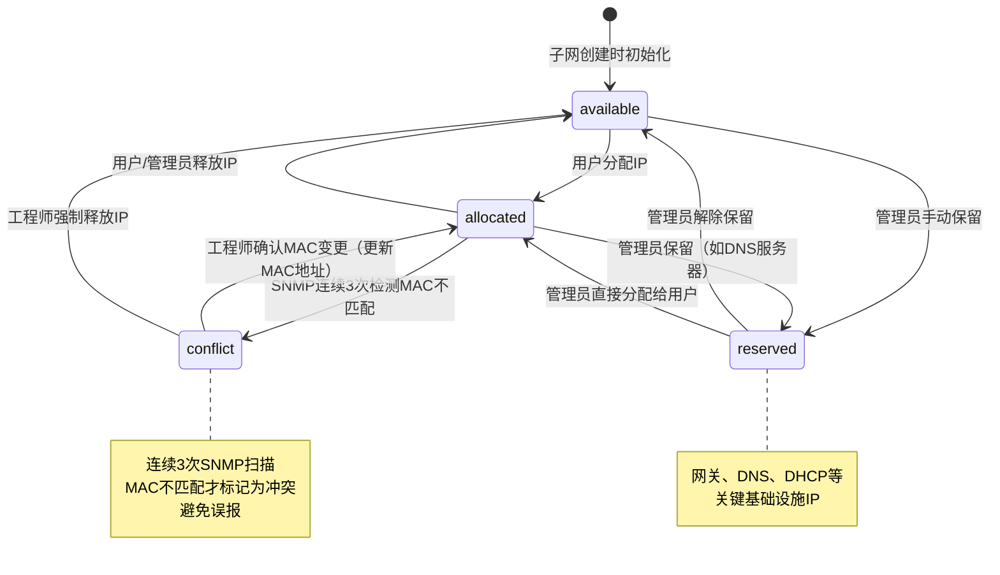

# 中创新航IPAM系统 - 部署实施计划

> **项目代号**: CALB-IPAM
> **文档版本**: v1.0
> **创建日期**: 2026-01-04
> **项目类型**: 企业级IP地址管理系统（完全离线部署）
> **预计工期**: 15个工作日

---

## 📋 执行摘要

### 项目概述

基于12个完整的HTML设计原型，实现一个生产级的IPAM（IP地址管理）系统，服务于中创新航工厂内网环境。系统采用Django 5.0.1 + PostgreSQL 15技术栈，支持完全离线部署，提供IP分配、子网管理、SNMP扫描、审计日志等核心功能。

### 关键成功因素

✅ **严格并发控制** - 使用数据库行锁和CAS原子更新防止IP分配冲突
✅ **完全离线部署** - 所有CDN资源本地化，无互联网依赖
✅ **100%设计还原** - 严格遵循HTML原型的视觉规范
✅ **生产级质量** - 完整的错误处理、事务保护、安全加固

### 核心技术栈

| 层级 | 技术选型 | 版本 | 用途 |
|-----|---------|------|------|
| **后端框架** | Django | 5.0.1 | Web应用框架 |
| **数据库** | PostgreSQL | 15 | 主数据库（支持INET网络类型）|
| **任务队列** | django-q2 | 最新 | 异步SNMP扫描任务 |
| **SNMP库** | pysnmp-lextudio | 7.1+ | 网络设备扫描 |
| **前端CSS** | Tailwind CSS | 3.4+ | 离线编译静态CSS |
| **前端交互** | Alpine.js | 3.14+ | 轻量级响应式框架 |
| **Web服务器** | Nginx + Gunicorn | 最新 | 生产环境部署 |
| **容器化** | Docker Compose | v2 | 一键部署方案 |

---

## 🎯 项目目标与范围

### 功能范围

#### ✅ 包含功能

1. **用户认证与权限**
   - 三角色体系（管理员、网络工程师、普通用户）
   - 基于Django内置用户系统
   - 会话超时30分钟
   - 所有敏感操作审计

2. **IP地址管理**
   - 4种状态管理（可用、已分配、保留、冲突）
   - 自助分配向导（3步骤）
   - 批量操作（释放、保留）
   - 并发分配保护（行锁+CAS）
   - IP详情页（历史记录、SNMP扫描记录）

3. **子网管理**
   - CIDR格式支持（192.168.10.0/24）
   - 自动初始化IP池（创建子网时批量生成IP记录）
   - 子网统计（使用率、可用数、已分配数）
   - 子网可视化（IP分布网格）

4. **SNMP网络扫描**
   - 支持SNMPv2c和SNMPv3
   - 异步任务队列（django-q2）
   - 定时扫描（每10分钟）
   - ARP表查询（OID: 1.3.6.1.2.1.4.22.1.2）
   - 自动冲突检测（MAC地址变化）
   - SNMP凭证加密存储（Fernet）

5. **审计日志**
   - 不可变日志（PostgreSQL触发器强制）
   - 记录所有IP操作（分配、释放、更新）
   - 多维度筛选（时间、用户、IP、操作类型）
   - 支持CSV导出

6. **仪表板**
   - 统计卡片（子网数、IP总数、各状态统计）
   - 图表展示（饼图、趋势图）
   - 高负载子网监控（使用率>80%）
   - 最近操作日志（最新10条）

#### ❌ 不包含功能（本期）

- IPv6支持（技术债务，未来版本）
- LDAP/AD域集成（未来版本）
- 邮件/短信告警（离线环境限制）
- 多租户隔离（单工厂使用）
- DNS/DHCP服务器集成（超出范围）

### 性能目标

| 指标 | 目标值 | 验收标准 |
|------|--------|----------|
| IP列表加载（10,000条记录） | <2秒 | 首屏渲染完成 |
| 并发IP分配（10用户） | 0冲突 | 100%成功率 |
| SNMP扫描（100个IP） | <30秒 | 单次扫描完成 |
| 子网创建（/24） | <5秒 | IP池初始化完成 |
| 子网创建（/16） | <3分钟 | 异步任务完成 |
| 批量释放（500个IP） | <10秒 | 全部释放成功 |
| 审计日志查询（100万条） | <3秒 | 分页返回50条 |

---

## 📊 需求分析总结

### 用户流程图

根据SpecFlow分析，系统包含8个核心用户流程：

```
1. 首次登录与初始化 → 管理员创建子网、配置SNMP、创建用户
2. 自助IP分配 → 普通用户3步骤申请IP
3. 批量IP释放 → 网络工程师批量操作
4. SNMP自动扫描 → 系统定时扫描并检测冲突
5. 冲突IP处理 → 工程师处理MAC地址不匹配
6. 子网创建与IP池初始化 → 管理员创建网段
7. 会话超时与重新认证 → 30分钟无操作强制登出
8. 审计日志查询 → 多维度筛选和导出
```

### 关键需求澄清（基于SpecFlow分析的47个待澄清点）

#### 🔴 P0阻塞性问题（已制定默认方案）

| 编号 | 问题 | 默认解决方案 |
|------|------|-------------|
| Q1 | IP状态转换规则 | "冲突"必须先人工确认后才能变为"可用"或"已分配" |
| Q2 | 三角色权限边界 | 网络工程师可创建子网但不可删除；普通用户仅能查看自己的IP |
| Q3 | 自助分配审批流程 | 采用无审批模式，所有用户直接分配 |
| Q4 | 子网删除级联策略 | 禁止删除包含已分配IP的子网（前端提示先释放） |
| Q5 | SNMP扫描重试策略 | 超时10秒，重试3次，间隔30秒，失败记录日志 |
| Q6 | 批量操作事务边界 | 部分成功模式（记录成功数和失败列表） |
| Q7 | IP池初始化性能 | 使用异步任务（django-q2），批量插入1000条/批次，显示进度 |

#### 🟠 P1重要问题（已制定默认方案）

| 编号 | 问题 | 默认解决方案 |
|------|------|-------------|
| Q8 | MAC地址格式 | 接受AA:BB:CC:DD:EE:FF、AA-BB-CC-DD-EE-FF、aabbccddeeff三种格式，统一存储为冒号分隔大写 |
| Q9 | 冲突检测容错 | 连续3次SNMP扫描MAC不匹配才标记为"冲突" |
| Q10 | 审计日志保留期 | 永久保留，不自动清理，提供CSV导出 |
| Q11 | 会话超时细节 | 从最后活动时间算，超时后重定向登录页且表单数据丢失 |
| Q12 | 子网自动保留IP | 仅保留网络地址（.0）和广播地址（.255） |
| Q13 | SNMP凭证密钥管理 | 存储在环境变量ENCRYPTION_KEY，独立于Django SECRET_KEY |
| Q14 | 多网关扫描策略 | 每个子网可配置独立网关，串行扫描避免资源竞争 |

### IP状态转换图（最终定义）



### 权限矩阵（最终定义）

| 功能 | 管理员 | 网络工程师 | 普通用户 | 备注 |
|-----|-------|-----------|---------|------|
| **子网管理** | | | | |
| 创建子网 | ✅ | ✅ | ❌ | |
| 删除子网 | ✅ | ❌ | ❌ | 仅限无已分配IP的子网 |
| 查看所有子网 | ✅ | ✅ | ✅ | |
| **IP管理** | | | | |
| 自助分配IP | ✅ | ✅ | ✅ | 3步骤向导 |
| 批量释放IP | ✅ | ✅ | ❌ | |
| 强制释放他人IP | ✅ | ✅ | ❌ | |
| 释放自己的IP | ✅ | ✅ | ✅ | |
| 保留IP | ✅ | ✅ | ❌ | |
| 查看所有IP | ✅ | ✅ | ❌ | 普通用户仅能查看自己的 |
| 处理冲突IP | ✅ | ✅ | ❌ | |
| **SNMP管理** | | | | |
| 配置SNMP凭证 | ✅ | ❌ | ❌ | 安全敏感 |
| 查看扫描日志 | ✅ | ✅ | ❌ | |
| 手动触发扫描 | ✅ | ✅ | ❌ | |
| **审计日志** | | | | |
| 查看所有日志 | ✅ | ✅ | ❌ | 普通用户仅能查看自己的 |
| 导出日志 | ✅ | ✅ | ❌ | |
| **用户管理** | | | | |
| 创建用户 | ✅ | ❌ | ❌ | |
| 删除用户 | ✅ | ❌ | ❌ | |
| 修改权限 | ✅ | ❌ | ❌ | |

---

## 🏗️ 技术架构设计

### 系统架构图

```
┌─────────────────────────────────────────────────────────────┐
│                        用户浏览器                              │
│         http://10.21.111.129 (80%-125%缩放支持)              │
└────────────────────┬────────────────────────────────────────┘
                     │ HTTP
                     ▼
┌─────────────────────────────────────────────────────────────┐
│                    Nginx (反向代理)                           │
│  - 静态文件服务 (Tailwind CSS, 字体, 图标)                    │
│  - Gzip压缩                                                   │
│  - 请求路由                                                   │
└────────────────────┬────────────────────────────────────────┘
                     │
                     ▼
┌─────────────────────────────────────────────────────────────┐
│              Django 5.0.1 + Gunicorn (4 workers)             │
│                                                               │
│  ┌─────────────┐  ┌─────────────┐  ┌─────────────┐         │
│  │   Views     │  │   Models    │  │  Templates  │         │
│  │  (业务逻辑)  │  │  (数据模型)  │  │ (HTML渲染)  │         │
│  └──────┬──────┘  └──────┬──────┘  └──────┬──────┘         │
│         │                 │                 │                 │
│         └─────────────────┴─────────────────┘                 │
│                           │                                   │
│         ┌─────────────────┴─────────────────┐                │
│         │                                   │                │
│         ▼                                   ▼                │
│  ┌─────────────┐                    ┌─────────────┐         │
│  │  SNMP扫描   │                    │  审计日志    │         │
│  │   Tasks     │                    │   中间件     │         │
│  └──────┬──────┘                    └─────────────┘         │
│         │                                                     │
└─────────┼─────────────────────────────────────────────────────┘
          │
          ▼
┌─────────────────────────────────────────────────────────────┐
│              django-q2 任务队列 (Redis Broker)                │
│  - SNMP周期性扫描 (每10分钟)                                  │
│  - IP池异步初始化                                             │
│  - 冲突检测任务                                               │
└────────────────────┬────────────────────────────────────────┘
                     │
                     ▼
┌─────────────────────────────────────────────────────────────┐
│                PostgreSQL 15 数据库                           │
│                                                               │
│  ┌──────────┐  ┌──────────┐  ┌──────────┐  ┌──────────┐   │
│  │  Subnet  │  │IpAddress │  │ Network  │  │AuditLog  │   │
│  │  (子网)   │  │ (IP地址) │  │  Device  │  │(审计日志) │   │
│  │          │  │          │  │ (网关)   │  │(不可变)   │   │
│  └────┬─────┘  └────┬─────┘  └────┬─────┘  └──────────┘   │
│       │             │              │                         │
│       └─────────────┴──────────────┘                         │
│                     │                                         │
│           ┌─────────┴─────────┐                              │
│           │                   │                              │
│           ▼                   ▼                              │
│    GiST索引 (网络范围)   B-tree索引 (IP/状态)                │
│    部分索引 (可用IP)     触发器 (审计日志不可变)              │
└─────────────────────────────────────────────────────────────┘

                           ▲
                           │ SNMP协议
                           │ (v2c/v3)
                           │
                  ┌────────┴────────┐
                  │  工厂网络设备    │
                  │  (交换机/路由器) │
                  │  提供ARP表数据   │
                  └─────────────────┘
```

### 数据库设计

#### 核心表结构

```sql
-- 子网表
CREATE TABLE subnets (
    id SERIAL PRIMARY KEY,
    network VARCHAR(43) NOT NULL UNIQUE,  -- CIDR格式，支持IPv6预留
    gateway INET NOT NULL,
    netmask INET NOT NULL,
    vlan_id INTEGER,
    description TEXT,
    created_at TIMESTAMP DEFAULT NOW(),
    updated_at TIMESTAMP DEFAULT NOW(),
    created_by INTEGER REFERENCES auth_user(id) ON DELETE SET NULL
);

-- GiST索引用于子网包含查询
CREATE INDEX idx_subnet_network_gist ON subnets USING GIST (network inet_ops);
CREATE INDEX idx_subnet_vlan ON subnets(vlan_id) WHERE vlan_id IS NOT NULL;

-- IP地址表
CREATE TABLE ip_addresses (
    id SERIAL PRIMARY KEY,
    subnet_id INTEGER NOT NULL REFERENCES subnets(id) ON DELETE PROTECT,
    address INET NOT NULL UNIQUE,
    status VARCHAR(20) NOT NULL CHECK (status IN ('available', 'allocated', 'reserved', 'conflict')),

    -- 设备信息
    hostname VARCHAR(255),
    mac_address VARCHAR(17),  -- 格式: AA:BB:CC:DD:EE:FF
    device_type VARCHAR(50),
    department VARCHAR(100),
    responsible_person VARCHAR(100),
    purpose TEXT,
    notes TEXT,

    -- 分配信息
    allocated_by INTEGER REFERENCES auth_user(id) ON DELETE SET NULL,
    allocated_at TIMESTAMP,

    -- 版本号（乐观锁）
    version INTEGER DEFAULT 0,

    -- 审计字段
    created_at TIMESTAMP DEFAULT NOW(),
    updated_at TIMESTAMP DEFAULT NOW(),

    -- 业务约束：已分配IP必须有MAC和分配人
    CONSTRAINT check_allocated_fields
        CHECK (
            (status = 'allocated' AND mac_address IS NOT NULL AND allocated_by IS NOT NULL) OR
            (status != 'allocated')
        )
);

-- 索引策略
CREATE INDEX idx_ip_status ON ip_addresses(status);
CREATE INDEX idx_ip_subnet_status ON ip_addresses(subnet_id, status);
CREATE INDEX idx_ip_mac ON ip_addresses(mac_address) WHERE mac_address IS NOT NULL;
CREATE INDEX idx_ip_allocated_at ON ip_addresses(allocated_at DESC) WHERE allocated_at IS NOT NULL;

-- 部分索引（仅索引可用IP，优化查询性能）
CREATE INDEX idx_available_ips ON ip_addresses(subnet_id, address)
WHERE status = 'available';

-- 网络设备表（SNMP扫描器）
CREATE TABLE network_devices (
    id SERIAL PRIMARY KEY,
    name VARCHAR(255) NOT NULL,
    ip_address INET NOT NULL UNIQUE,

    -- SNMP配置
    snmp_version VARCHAR(10) NOT NULL CHECK (snmp_version IN ('v2c', 'v3')),
    snmp_community VARCHAR(255),  -- v2c密钥

    -- v3凭证（加密存储）
    snmp_username VARCHAR(255),
    snmp_auth_password_encrypted BYTEA,
    snmp_priv_password_encrypted BYTEA,
    snmp_auth_protocol VARCHAR(20),  -- SHA256
    snmp_priv_protocol VARCHAR(20),  -- AES256

    -- 状态
    enabled BOOLEAN DEFAULT TRUE,
    last_scan_at TIMESTAMP,
    last_scan_status VARCHAR(20),  -- success/timeout/auth_failed

    created_at TIMESTAMP DEFAULT NOW(),
    updated_at TIMESTAMP DEFAULT NOW()
);

-- SNMP扫描记录表
CREATE TABLE snmp_scan_records (
    id SERIAL PRIMARY KEY,
    device_id INTEGER NOT NULL REFERENCES network_devices(id) ON DELETE CASCADE,
    ip_address INET NOT NULL,
    mac_address VARCHAR(17),
    interface VARCHAR(50),
    scanned_at TIMESTAMP DEFAULT NOW(),

    -- 索引
    CONSTRAINT idx_scan_ip_time UNIQUE (ip_address, scanned_at)
);
CREATE INDEX idx_scan_device_time ON snmp_scan_records(device_id, scanned_at DESC);
CREATE INDEX idx_scan_ip ON snmp_scan_records(ip_address, scanned_at DESC);

-- 审计日志表（不可变）
CREATE TABLE audit_logs (
    id UUID PRIMARY KEY DEFAULT gen_random_uuid(),
    timestamp TIMESTAMP NOT NULL DEFAULT NOW(),

    -- 用户信息
    user_id INTEGER REFERENCES auth_user(id) ON DELETE SET NULL,
    user_ip INET,
    username VARCHAR(150),  -- 冗余存储，防止用户删除后丢失信息

    -- 操作信息
    action VARCHAR(50) NOT NULL,  -- allocate/release/reserve/update/conflict

    -- IP信息
    ip_address INET NOT NULL,
    subnet_network VARCHAR(43),
    hostname VARCHAR(255),
    mac_address VARCHAR(17),

    -- 变更详情（JSON格式）
    old_values JSONB,
    new_values JSONB,
    details JSONB
);

-- 索引
CREATE INDEX idx_audit_time ON audit_logs(timestamp DESC);
CREATE INDEX idx_audit_user_time ON audit_logs(user_id, timestamp DESC);
CREATE INDEX idx_audit_ip_time ON audit_logs(ip_address, timestamp DESC);
CREATE INDEX idx_audit_action ON audit_logs(action);

-- 触发器：禁止UPDATE和DELETE
CREATE OR REPLACE FUNCTION prevent_audit_modification()
RETURNS TRIGGER AS $$
BEGIN
    IF TG_OP = 'UPDATE' THEN
        RAISE EXCEPTION '审计日志不可修改';
    ELSIF TG_OP = 'DELETE' THEN
        RAISE EXCEPTION '审计日志不可删除';
    END IF;
    RETURN NULL;
END;
$$ LANGUAGE plpgsql;

CREATE TRIGGER audit_immutable_trigger
BEFORE UPDATE OR DELETE ON audit_logs
FOR EACH ROW
EXECUTE FUNCTION prevent_audit_modification();

-- 分区表优化（可选，用于大数据量场景）
-- 按月分区审计日志
-- CREATE TABLE audit_logs_2026_01 PARTITION OF audit_logs
-- FOR VALUES FROM ('2026-01-01') TO ('2026-02-01');
```

### 前端设计系统提取

基于HTML原型分析，提取的设计系统规范：

#### 颜色系统

```javascript
// tailwind.config.js
module.exports = {
  theme: {
    extend: {
      colors: {
        // 主色调
        'primary': {
          DEFAULT: '#2463eb',
          '50': '#eff6ff',
          '100': '#dbeafe',
          '500': '#2463eb',
          '600': '#1d4ed8',
          '900': '#1e3a8a',
        },

        // 暗黑模式背景
        'bg-dark': {
          DEFAULT: '#111621',
          'surface': '#1e2430',
          'elevated': '#1c1f27',
        },

        // 边框
        'border-dark': {
          DEFAULT: '#2a3241',
          'light': '#334155',
        },

        // 文本
        'text-secondary': '#9da6b9',

        // 状态色
        'status': {
          'available': '#22c55e',    // 绿色
          'allocated': '#2463eb',    // 蓝色
          'reserved': '#f59e0b',     // 橙色
          'conflict': '#ef4444',     // 红色
        }
      },

      fontFamily: {
        'sans': ['Inter', 'Microsoft YaHei', 'sans-serif'],
        'mono': ['SFMono-Regular', 'Monaco', 'Consolas', 'monospace'],
      },
    },
  },

  darkMode: 'class',

  plugins: [
    require('@tailwindcss/forms'),
  ],
}
```

#### 可复用组件清单

基于原型分析，需实现24个核心组件：

**Level 1 - 基础组件（8个）**
1. Button 按钮 - 5种变体（primary, secondary, danger, ghost, icon）
2. Input 输入框 - 支持前缀图标、后缀按钮、验证状态
3. Select 下拉选择 - 自定义箭头样式
4. Checkbox 复选框 - 深色模式适配
5. Badge 徽章 - 状态色系统（success, warning, error, info）
6. Card 卡片 - 基础容器组件
7. Modal 模态框 - 对话框基础
8. Toast 通知 - 成功/错误消息

**Level 2 - 数据展示组件（6个）**
9. Table 表格 - 带排序、选择、分页
10. Pagination 分页 - 完整分页控制
11. StatCard 统计卡片 - 带图标和趋势指示
12. ProgressBar 进度条 - 百分比显示
13. Timeline 时间线 - 审计日志专用
14. PieChart 饼图 - 数据可视化（CSS实现）

**Level 3 - 导航组件（4个）**
15. Sidebar 侧边栏 - 可折叠导航
16. Breadcrumb 面包屑 - 路径导航
17. Tabs 标签页 - 内容切换
18. TopNav 顶部导航 - 主导航栏

**Level 4 - 表单组件（4个）**
19. FormGroup 表单组 - 标签+输入+验证提示
20. SearchBar 搜索栏 - 带图标和清除按钮
21. FilterPanel 筛选面板 - 多条件筛选
22. DateRangePicker 日期范围选择器

**Level 5 - 特殊组件（2个）**
23. IpGrid IP网格 - 256个单元格的交互式网格
24. Loading 加载状态 - 骨架屏/转圈

---

## 📝 实施计划详解

### Phase 1: 环境搭建与基础设施（Day 1-2）

#### 1.1 Docker环境配置

**目标**: 创建完整的Docker Compose配置，支持离线部署

**任务清单**:
- [ ] 创建`docker-compose.yml`（绑定到10.21.111.129:80）
- [ ] 配置PostgreSQL 15服务（持久化数据卷）
- [ ] 配置Redis 7服务（django-q2 broker）
- [ ] 配置Nginx服务（静态文件+反向代理）
- [ ] 创建`.env.example`环境变量模板
- [ ] 编写`Dockerfile`（多阶段构建优化）

**关键文件**:

```yaml
# docker-compose.yml
version: '3.8'

services:
  db:
    image: postgres:15-alpine
    container_name: ipam-postgres
    environment:
      POSTGRES_DB: ${DB_NAME:-ipam_db}
      POSTGRES_USER: ${DB_USER:-ipam_user}
      POSTGRES_PASSWORD: ${DB_PASSWORD}
    volumes:
      - postgres_data:/var/lib/postgresql/data
      - ./init-db.sql:/docker-entrypoint-initdb.d/init.sql
    networks:
      - ipam-network
    restart: unless-stopped
    healthcheck:
      test: ["CMD-SHELL", "pg_isready -U ${DB_USER:-ipam_user}"]
      interval: 10s
      timeout: 5s
      retries: 5

  redis:
    image: redis:7-alpine
    container_name: ipam-redis
    command: redis-server --appendonly yes
    volumes:
      - redis_data:/data
    networks:
      - ipam-network
    restart: unless-stopped
    healthcheck:
      test: ["CMD", "redis-cli", "ping"]
      interval: 10s

  web:
    build:
      context: .
      dockerfile: Dockerfile
    container_name: ipam-web
    command: >
      sh -c "
        python manage.py migrate &&
        python manage.py collectstatic --noinput &&
        gunicorn ipam_project.wsgi:application
          --bind 0.0.0.0:8000
          --workers 4
          --timeout 120
          --access-logfile -
          --error-logfile -
      "
    volumes:
      - ./backend:/app
      - static_volume:/app/staticfiles
      - media_volume:/app/media
    environment:
      - DJANGO_SETTINGS_MODULE=ipam_project.settings
      - SECRET_KEY=${SECRET_KEY}
      - ENCRYPTION_KEY=${ENCRYPTION_KEY}
      - DB_NAME=${DB_NAME:-ipam_db}
      - DB_USER=${DB_USER:-ipam_user}
      - DB_PASSWORD=${DB_PASSWORD}
      - DB_HOST=db
      - DB_PORT=5432
      - REDIS_HOST=redis
      - ALLOWED_HOSTS=10.21.111.129,localhost
      - CSRF_TRUSTED_ORIGINS=http://10.21.111.129
    networks:
      - ipam-network
    depends_on:
      db:
        condition: service_healthy
      redis:
        condition: service_healthy

  qcluster:
    build:
      context: .
      dockerfile: Dockerfile
    container_name: ipam-qcluster
    command: python manage.py qcluster
    volumes:
      - ./backend:/app
    environment:
      - DJANGO_SETTINGS_MODULE=ipam_project.settings
      - SECRET_KEY=${SECRET_KEY}
      - ENCRYPTION_KEY=${ENCRYPTION_KEY}
      - DB_NAME=${DB_NAME:-ipam_db}
      - DB_USER=${DB_USER:-ipam_user}
      - DB_PASSWORD=${DB_PASSWORD}
      - DB_HOST=db
      - REDIS_HOST=redis
    networks:
      - ipam-network
    depends_on:
      db:
        condition: service_healthy
      redis:
        condition: service_healthy
    restart: unless-stopped

  nginx:
    image: nginx:1.25-alpine
    container_name: ipam-nginx
    volumes:
      - ./nginx.conf:/etc/nginx/nginx.conf:ro
      - static_volume:/static:ro
      - media_volume:/media:ro
    ports:
      - "10.21.111.129:80:80"
    networks:
      - ipam-network
    depends_on:
      - web
    restart: unless-stopped

volumes:
  postgres_data:
  redis_data:
  static_volume:
  media_volume:

networks:
  ipam-network:
    driver: bridge
```

```.env.example
# .env.example - 复制为.env并填写实际值

# Django配置
SECRET_KEY=<生成64字符随机密钥>
ENCRYPTION_KEY=<Fernet生成的密钥>
DEBUG=0

# 数据库配置
DB_NAME=ipam_db
DB_USER=ipam_user
DB_PASSWORD=<强密码>

# 网络配置
ALLOWED_HOSTS=10.21.111.129,localhost
CSRF_TRUSTED_ORIGINS=http://10.21.111.129
```

**验收标准**:
- `docker-compose up -d` 成功启动所有服务
- 从10.21.111.129可访问默认Django欢迎页
- PostgreSQL健康检查通过
- Redis健康检查通过

---

#### 1.2 Django项目初始化

**目标**: 创建标准Django项目结构

**项目结构**:
```
backend/
├── manage.py
├── requirements.txt
├── ipam_project/
│   ├── __init__.py
│   ├── settings.py
│   ├── urls.py
│   ├── wsgi.py
│   └── asgi.py
├── apps/
│   ├── __init__.py
│   ├── core/              # 核心应用
│   │   ├── models.py      # 基础Model
│   │   ├── middleware.py  # 审计中间件
│   │   └── utils.py
│   ├── ipam/              # IP管理应用
│   │   ├── models.py      # Subnet, IpAddress
│   │   ├── views.py
│   │   ├── forms.py
│   │   ├── services.py    # 业务逻辑层
│   │   └── tasks.py       # django-q2任务
│   ├── snmp/              # SNMP扫描应用
│   │   ├── models.py      # NetworkDevice, ScanRecord
│   │   ├── scanner.py     # SNMP扫描逻辑
│   │   └── tasks.py
│   └── audit/             # 审计日志应用
│       ├── models.py      # AuditLog
│       └── middleware.py  # 自动记录中间件
├── templates/
│   ├── base.html
│   ├── layouts/
│   │   ├── sidebar_layout.html
│   │   └── top_nav_layout.html
│   ├── components/
│   │   ├── button.html
│   │   ├── card.html
│   │   └── ...
│   └── pages/
│       ├── login.html
│       ├── dashboard.html
│       └── ...
└── static/
    ├── css/
    │   ├── input.css       # Tailwind输入
    │   └── tailwind.css    # 编译输出
    ├── js/
    │   ├── alpine.min.js
    │   └── stores.js
    └── fonts/
        ├── Inter/
        └── material-symbols/
```

**requirements.txt**:
```txt
# 核心框架
Django==5.0.1
psycopg2-binary==2.9.9
gunicorn==21.2.0

# 任务队列
django-q2==1.6.2
redis==5.0.1

# SNMP
pysnmp-lextudio==5.0.33

# 加密
cryptography==42.0.0

# 工具库
python-dotenv==1.0.0
Pillow==10.2.0
```

---

#### 1.3 Tailwind CSS离线配置

**目标**: 将HTML原型的CDN Tailwind转换为本地编译版本

**步骤**:

1. **下载Tailwind CLI独立可执行文件**（在有网络环境）:
```bash
# Linux x64
curl -sLO https://github.com/tailwindlabs/tailwindcss/releases/download/v3.4.16/tailwindcss-linux-x64
chmod +x tailwindcss-linux-x64
mv tailwindcss-linux-x64 /usr/local/bin/tailwindcss
```

2. **创建Tailwind配置**:
```javascript
// tailwind.config.js
module.exports = {
  content: [
    './templates/**/*.html',
    './apps/*/templates/**/*.html',
  ],

  darkMode: 'class',

  theme: {
    extend: {
      colors: {
        'primary': '#2463eb',
        'bg-dark': '#111621',
        'surface-dark': '#1e2430',
        'border-dark': '#2a3241',
        'text-secondary': '#9da6b9',
      },
      fontFamily: {
        'sans': ['Inter', 'Microsoft YaHei', 'sans-serif'],
        'mono': ['SFMono-Regular', 'Monaco', 'Consolas', 'monospace'],
      },
    },
  },

  plugins: [
    require('@tailwindcss/forms'),
  ],
}
```

3. **创建输入CSS**:
```css
/* static/css/input.css */
@tailwind base;
@tailwind components;
@tailwind utilities;

@layer base {
  :root {
    --color-primary: 36 99 235;
  }
}

@layer components {
  .btn-primary {
    @apply px-5 py-2.5 rounded-lg bg-primary hover:bg-blue-600 text-white font-bold text-sm shadow-lg shadow-primary/20 transition-all;
  }

  .btn-secondary {
    @apply px-4 py-2.5 rounded-lg bg-surface-dark border border-border-dark text-white hover:bg-border-dark transition-colors text-sm font-medium;
  }
}
```

4. **编译命令**:
```bash
# 开发模式（监听变化）
tailwindcss -i ./static/css/input.css -o ./static/css/tailwind.css --watch

# 生产构建（压缩）
tailwindcss -i ./static/css/input.css -o ./static/css/tailwind.min.css --minify
```

5. **字体文件离线化**:
```bash
# 下载Inter字体
mkdir -p static/fonts/Inter
cd static/fonts/Inter
wget https://github.com/rsms/inter/releases/download/v4.0/Inter-4.0.zip
unzip Inter-4.0.zip

# 下载Material Symbols字体
mkdir -p static/fonts/material-symbols
# 手动从Google Fonts下载woff2文件
```

6. **创建字体CSS**:
```css
/* static/css/fonts.css */
@font-face {
  font-family: 'Inter';
  src: url('../fonts/Inter/Inter-Regular.woff2') format('woff2');
  font-weight: 400;
  font-display: swap;
}

@font-face {
  font-family: 'Inter';
  src: url('../fonts/Inter/Inter-Bold.woff2') format('woff2');
  font-weight: 700;
  font-display: swap;
}

@font-face {
  font-family: 'Material Symbols Outlined';
  src: url('../fonts/material-symbols/MaterialSymbolsOutlined.woff2') format('woff2');
  font-weight: normal;
  font-display: block;
}

.material-symbols-outlined {
  font-family: 'Material Symbols Outlined';
  font-size: 24px;
  line-height: 1;
  display: inline-block;
}
```

**验收标准**:
- Tailwind CSS编译成功，文件大小<500KB
- 所有字体文件加载正常
- HTML原型的样式100%复现

---

### Phase 2: 后端核心开发（Day 3-5）

#### 2.1 数据模型实现

**目标**: 实现所有核心数据模型

**models.py**:
```python
# apps/ipam/models.py
from django.db import models
from django.contrib.auth.models import User
from cryptography.fernet import Fernet
from django.conf import settings
import uuid

class Subnet(models.Model):
    """子网模型"""
    network = models.CharField(max_length=43, unique=True, help_text="CIDR格式")
    gateway = models.GenericIPAddressField()
    netmask = models.GenericIPAddressField()
    vlan_id = models.IntegerField(null=True, blank=True, db_index=True)
    description = models.TextField()
    created_at = models.DateTimeField(auto_now_add=True)
    updated_at = models.DateTimeField(auto_now=True)
    created_by = models.ForeignKey(User, null=True, on_delete=models.SET_NULL)

    class Meta:
        db_table = 'subnets'
        indexes = [
            models.Index(fields=['network']),
            models.Index(fields=['-created_at']),
        ]

    def __str__(self):
        return self.network

class IpAddress(models.Model):
    """IP地址模型"""
    STATUS_CHOICES = [
        ('available', '可用'),
        ('allocated', '已分配'),
        ('reserved', '保留'),
        ('conflict', '冲突'),
    ]

    subnet = models.ForeignKey(Subnet, on_delete=models.PROTECT, related_name='ip_addresses')
    address = models.GenericIPAddressField(unique=True, db_index=True)
    status = models.CharField(max_length=20, choices=STATUS_CHOICES, default='available', db_index=True)

    # 设备信息
    hostname = models.CharField(max_length=255, blank=True, db_index=True)
    mac_address = models.CharField(max_length=17, blank=True, db_index=True)
    device_type = models.CharField(max_length=50, blank=True)
    department = models.CharField(max_length=100, blank=True)
    responsible_person = models.CharField(max_length=100, blank=True)
    purpose = models.TextField(blank=True)
    notes = models.TextField(blank=True)

    # 分配信息
    allocated_at = models.DateTimeField(null=True, blank=True)
    allocated_by = models.ForeignKey(User, null=True, blank=True, on_delete=models.SET_NULL)

    # 版本号（乐观锁）
    version = models.IntegerField(default=0)

    # 审计字段
    created_at = models.DateTimeField(auto_now_add=True)
    updated_at = models.DateTimeField(auto_now=True)

    class Meta:
        db_table = 'ip_addresses'
        indexes = [
            models.Index(fields=['subnet', 'status']),
            models.Index(fields=['status', '-allocated_at']),
            models.Index(fields=['mac_address', 'status']),
        ]
        constraints = [
            models.CheckConstraint(
                check=models.Q(status='allocated', mac_address__isnull=False, allocated_by__isnull=False) |
                      ~models.Q(status='allocated'),
                name='check_allocated_fields'
            )
        ]

class NetworkDevice(models.Model):
    """网络设备（SNMP扫描器）"""
    SNMP_VERSION_CHOICES = [
        ('v2c', 'SNMPv2c'),
        ('v3', 'SNMPv3'),
    ]

    name = models.CharField(max_length=255)
    ip_address = models.GenericIPAddressField(unique=True)
    snmp_version = models.CharField(max_length=10, choices=SNMP_VERSION_CHOICES)

    # v2c凭证
    snmp_community = models.CharField(max_length=255, blank=True)

    # v3凭证（加密存储）
    snmp_username = models.CharField(max_length=255, blank=True)
    snmp_auth_password_encrypted = models.BinaryField(blank=True, null=True)
    snmp_priv_password_encrypted = models.BinaryField(blank=True, null=True)

    enabled = models.BooleanField(default=True)
    last_scan_at = models.DateTimeField(null=True, blank=True)

    @property
    def _cipher(self):
        key = settings.ENCRYPTION_KEY.encode()
        return Fernet(key)

    def set_auth_password(self, password):
        if password:
            encrypted = self._cipher.encrypt(password.encode())
            self.snmp_auth_password_encrypted = encrypted

    def get_auth_password(self):
        if self.snmp_auth_password_encrypted:
            return self._cipher.decrypt(bytes(self.snmp_auth_password_encrypted)).decode()
        return None

class AuditLog(models.Model):
    """审计日志（不可变）"""
    id = models.UUIDField(primary_key=True, default=uuid.uuid4, editable=False)
    timestamp = models.DateTimeField(auto_now_add=True, db_index=True)

    user = models.ForeignKey(User, on_delete=models.SET_NULL, null=True)
    user_ip = models.GenericIPAddressField(null=True, blank=True)

    action = models.CharField(max_length=50, db_index=True)
    ip_address = models.GenericIPAddressField(db_index=True)
    hostname = models.CharField(max_length=255, blank=True)
    mac_address = models.CharField(max_length=17, blank=True)

    details = models.JSONField(default=dict)
    old_values = models.JSONField(null=True, blank=True)
    new_values = models.JSONField(null=True, blank=True)

    class Meta:
        db_table = 'audit_logs'
        ordering = ['-timestamp']

    def save(self, *args, **kwargs):
        if self.pk and AuditLog.objects.filter(pk=self.pk).exists():
            raise ValueError("审计日志不可修改")
        super().save(*args, **kwargs)

    def delete(self, *args, **kwargs):
        raise ValueError("审计日志不可删除")
```

**迁移文件**:
```python
# migrations/0002_create_triggers.py
from django.db import migrations

class Migration(migrations.Migration):
    dependencies = [
        ('audit', '0001_initial'),
    ]

    operations = [
        migrations.RunSQL(
            sql="""
                CREATE OR REPLACE FUNCTION prevent_audit_modification()
                RETURNS TRIGGER AS $$
                BEGIN
                    IF TG_OP = 'UPDATE' THEN
                        RAISE EXCEPTION '审计日志不可修改';
                    ELSIF TG_OP = 'DELETE' THEN
                        RAISE EXCEPTION '审计日志不可删除';
                    END IF;
                    RETURN NULL;
                END;
                $$ LANGUAGE plpgsql;

                CREATE TRIGGER audit_immutable_trigger
                BEFORE UPDATE OR DELETE ON audit_logs
                FOR EACH ROW
                EXECUTE FUNCTION prevent_audit_modification();
            """,
            reverse_sql="""
                DROP TRIGGER IF EXISTS audit_immutable_trigger ON audit_logs;
                DROP FUNCTION IF EXISTS prevent_audit_modification();
            """
        ),
    ]
```

**验收标准**:
- 所有模型迁移成功
- Django Admin可正常操作
- 审计日志触发器生效（UPDATE/DELETE抛出异常）

---

#### 2.2 并发安全的IP分配逻辑

**目标**: 实现无冲突的IP分配

**services.py**:
```python
# apps/ipam/services.py
from django.db import transaction
from django.utils import timezone
from django.core.exceptions import ValidationError
from .models import IpAddress, AuditLog
import logging

logger = logging.getLogger(__name__)

@transaction.atomic
def allocate_ip_address(ip_id, user, device_info, request=None):
    """
    原子性IP分配 - 使用数据库行锁防止并发冲突

    参数:
        ip_id: IP地址ID
        user: 分配用户
        device_info: dict包含hostname, mac_address等
        request: HTTP请求对象（用于记录用户IP）

    返回:
        IpAddress对象
    """
    try:
        # 悲观锁：SELECT FOR UPDATE锁定行直到事务结束
        ip = IpAddress.objects.select_for_update(nowait=True).get(pk=ip_id)

        # 双重检查状态
        if ip.status != 'available':
            raise ValidationError(f"IP {ip.address} 当前状态为 {ip.get_status_display()}，无法分配")

        # 验证MAC地址格式
        mac = device_info.get('mac_address', '').strip()
        if mac:
            mac = normalize_mac_address(mac)

        # 记录旧值用于审计
        old_values = {
            'status': ip.status,
            'mac_address': ip.mac_address,
            'hostname': ip.hostname,
        }

        # 原子更新所有字段
        ip.status = 'allocated'
        ip.hostname = device_info.get('hostname', '')
        ip.mac_address = mac
        ip.device_type = device_info.get('device_type', '')
        ip.department = device_info.get('department', '')
        ip.responsible_person = device_info.get('responsible_person', '')
        ip.purpose = device_info.get('purpose', '')
        ip.notes = device_info.get('notes', '')
        ip.allocated_at = timezone.now()
        ip.allocated_by = user
        ip.save()

        # 记录审计日志
        AuditLog.objects.create(
            user=user,
            user_ip=request.META.get('REMOTE_ADDR') if request else None,
            action='allocate',
            ip_address=str(ip.address),
            hostname=ip.hostname,
            mac_address=ip.mac_address,
            old_values=old_values,
            new_values={
                'status': ip.status,
                'mac_address': ip.mac_address,
                'hostname': ip.hostname,
            },
            details={
                'subnet': str(ip.subnet.network),
                'device_type': ip.device_type,
                'department': ip.department,
            }
        )

        logger.info(f"用户 {user.username} 成功分配IP {ip.address}")
        return ip

    except IpAddress.DoesNotExist:
        raise ValidationError("IP地址不存在")
    except Exception as e:
        logger.error(f"IP分配失败: {e}")
        raise

def normalize_mac_address(mac):
    """标准化MAC地址格式为 AA:BB:CC:DD:EE:FF"""
    mac = mac.replace('-', ':').replace('.', ':').upper()
    parts = mac.split(':')
    if len(parts) != 6:
        raise ValidationError("MAC地址格式错误")
    return ':'.join(parts)

@transaction.atomic
def batch_release_ips(ip_ids, user, request=None):
    """批量释放IP - 部分成功模式"""
    success_count = 0
    failed_ips = []

    for ip_id in ip_ids:
        try:
            ip = IpAddress.objects.select_for_update(nowait=True).get(pk=ip_id)

            if ip.status != 'allocated':
                failed_ips.append({'id': ip_id, 'reason': '状态不是已分配'})
                continue

            old_values = {
                'status': ip.status,
                'mac_address': ip.mac_address,
                'hostname': ip.hostname,
            }

            ip.status = 'available'
            ip.hostname = ''
            ip.mac_address = ''
            ip.device_type = ''
            ip.department = ''
            ip.responsible_person = ''
            ip.purpose = ''
            ip.notes = ''
            ip.allocated_at = None
            ip.allocated_by = None
            ip.save()

            # 记录审计日志
            AuditLog.objects.create(
                user=user,
                user_ip=request.META.get('REMOTE_ADDR') if request else None,
                action='release',
                ip_address=str(ip.address),
                old_values=old_values,
                new_values={'status': 'available'},
                details={'batch_operation': True}
            )

            success_count += 1

        except IpAddress.DoesNotExist:
            failed_ips.append({'id': ip_id, 'reason': 'IP不存在'})
        except Exception as e:
            failed_ips.append({'id': ip_id, 'reason': str(e)})

    return {
        'success_count': success_count,
        'failed_count': len(failed_ips),
        'failed_ips': failed_ips
    }
```

**验收标准**:
- 10个用户并发分配同一IP，仅1个成功，其余9个收到错误提示
- 批量释放500个IP，部分失败时返回详细报告
- 所有操作记录到审计日志

---

### Phase 3: SNMP扫描实现（Day 6-7）

#### 3.1 SNMP扫描任务

**tasks.py**:
```python
# apps/snmp/tasks.py
from django_q.tasks import async_task, schedule
from django_q.models import Schedule
from pysnmp.hlapi.v3arch.asyncio import *
from django.utils import timezone
import logging
import asyncio

logger = logging.getLogger(__name__)

async def scan_arp_table_v2c(device):
    """SNMPv2c扫描ARP表"""
    arp_entries = []

    arp_oid = ObjectType(ObjectIdentity('1.3.6.1.2.1.4.22.1.2'))

    snmpEngine = SnmpEngine()

    try:
        iterator = bulk_cmd(
            snmpEngine,
            CommunityData(device.snmp_community, mpModel=1),
            await UdpTransportTarget.create((device.ip_address, 161), timeout=10, retries=3),
            ContextData(),
            0, 50,
            arp_oid,
        )

        async for errorIndication, errorStatus, errorIndex, varBinds in iterator:
            if errorIndication:
                logger.error(f"SNMP错误: {errorIndication}")
                break
            elif errorStatus:
                logger.error(f"SNMP协议错误: {errorStatus.prettyPrint()}")
                break
            else:
                for oid, value in varBinds:
                    oid_parts = oid.prettyPrint().split('.')
                    if len(oid_parts) >= 4:
                        ip_address = '.'.join(oid_parts[-4:])
                        mac_address = format_mac(value.prettyPrint())
                        arp_entries.append({
                            'ip': ip_address,
                            'mac': mac_address,
                        })

    finally:
        snmpEngine.close_dispatcher()

    return arp_entries

def format_mac(mac_hex):
    """格式化MAC地址"""
    mac_bytes = mac_hex.replace('0x', '').replace(' ', '')
    return ':'.join([mac_bytes[i:i+2] for i in range(0, len(mac_bytes), 2)]).upper()

def scan_network_device(device_id):
    """扫描单个网络设备"""
    from .models import NetworkDevice, ScanRecord
    from apps.ipam.models import IpAddress

    try:
        device = NetworkDevice.objects.get(pk=device_id, enabled=True)

        # 执行异步扫描
        if device.snmp_version == 'v2c':
            results = asyncio.run(scan_arp_table_v2c(device))
        else:
            logger.warning(f"SNMPv3暂未实现")
            return {'success': False, 'error': 'SNMPv3 not implemented'}

        # 更新扫描时间
        device.last_scan_at = timezone.now()
        device.last_scan_status = 'success'
        device.save()

        # 处理扫描结果 - 冲突检测
        conflict_count = 0
        for entry in results:
            ip_str = entry['ip']
            mac_str = entry['mac']

            try:
                ip_obj = IpAddress.objects.get(address=ip_str, status='allocated')

                # 检测MAC地址变化
                if ip_obj.mac_address and ip_obj.mac_address.upper() != mac_str:
                    # 增加冲突检测计数器（可选，使用version字段）
                    ip_obj.version += 1

                    # 连续3次检测到不匹配才标记冲突
                    if ip_obj.version >= 3:
                        ip_obj.status = 'conflict'
                        ip_obj.notes = f"冲突检测: DB MAC={ip_obj.mac_address}, 扫描MAC={mac_str}"
                        conflict_count += 1
                        logger.warning(f"IP冲突: {ip_str} - DB: {ip_obj.mac_address}, Scan: {mac_str}")

                    ip_obj.save()
                else:
                    # MAC匹配，重置计数器
                    if ip_obj.version > 0:
                        ip_obj.version = 0
                        ip_obj.save()

                # 记录扫描历史
                ScanRecord.objects.create(
                    device=device,
                    ip_address=ip_obj,
                    mac_address=mac_str,
                    scanned_at=timezone.now()
                )

            except IpAddress.DoesNotExist:
                logger.debug(f"扫描到未管理的IP: {ip_str}")

        logger.info(f"设备 {device.name} 扫描完成，{len(results)} 条记录，{conflict_count} 个冲突")

        return {
            'success': True,
            'device_name': device.name,
            'arp_count': len(results),
            'conflicts': conflict_count
        }

    except NetworkDevice.DoesNotExist:
        return {'success': False, 'error': 'Device not found'}
    except Exception as e:
        logger.exception(f"扫描失败: {e}")
        return {'success': False, 'error': str(e)}

def scan_all_devices():
    """扫描所有启用的设备"""
    from .models import NetworkDevice

    devices = NetworkDevice.objects.filter(enabled=True)

    for device in devices:
        async_task(
            'apps.snmp.tasks.scan_network_device',
            device.id,
            timeout=300,
            retry=3
        )

    logger.info(f"已调度 {devices.count()} 个设备的扫描任务")

# 设置定时任务（在Django启动时调用）
def setup_snmp_schedule():
    """设置SNMP定时扫描"""
    Schedule.objects.filter(func='apps.snmp.tasks.scan_all_devices').delete()

    schedule(
        'apps.snmp.tasks.scan_all_devices',
        schedule_type=Schedule.MINUTES,
        minutes=10,
        repeats=-1
    )

    logger.info("SNMP扫描定时任务已设置：每10分钟执行一次")
```

**验收标准**:
- SNMP扫描成功返回ARP表数据
- MAC地址变化连续3次后标记为冲突
- 定时任务每10分钟自动执行

---

### Phase 4: 前端模板转换（Day 8-12）

#### 4.1 基础模板层级

**base.html**:
```django
<!DOCTYPE html>
<html class="dark" lang="zh-CN">
<head>
    <meta charset="UTF-8">
    <meta name="viewport" content="width=device-width, initial-scale=1.0">
    <meta name="csrf-token" content="{{ csrf_token }}">
    <title>中创新航 IPAM</title>

    
    <link href="" rel="stylesheet">
    <link href="" rel="stylesheet">
    
</head>
<body class="bg-bg-dark text-white font-sans">
    

    <script defer src=""></script>
    
</body>
</html>
```

**sidebar_layout.html**:
```django



<div class="flex h-screen w-full">
    

    <main class="flex-1 flex flex-col overflow-hidden">
        

        <div class="flex-1 overflow-y-auto p-8">
            
        </div>
    </main>
</div>

```

**components/sidebar.html**:
```django
<aside class="w-64 bg-surface-dark border-r border-border-dark flex flex-col">
    <!-- Logo -->
    <div class="p-6 border-b border-border-dark">
        <div class="flex items-center gap-3">
            <span class="material-symbols-outlined text-primary text-3xl filled">hub</span>
            <div>
                <h1 class="text-lg font-bold">中创新航</h1>
                <p class="text-xs text-text-secondary">IP 地址管理系统</p>
            </div>
        </div>
    </div>

    <!-- Navigation -->
    <nav class="flex-1 p-4 space-y-1">
        
        <a href="{{ dashboard_url }}"
           class="flex items-center gap-3 px-3 py-2.5 rounded-lg bg-primary text-whitetext-gray-400 hover:bg-border-dark transition-colors">
            <span class="material-symbols-outlined filled">dashboard</span>
            <span class="text-sm font-medium">仪表板</span>
        </a>

        
        
        <a href="{{ ip_list_url }}"
           class="flex items-center gap-3 px-3 py-2.5 rounded-lg bg-primary text-whitetext-gray-400 hover:bg-border-dark transition-colors">
            <span class="material-symbols-outlined">lan</span>
            <span class="text-sm font-medium">IP 地址管理</span>
        </a>
        

        <!-- 更多导航项... -->
    </nav>

    <!-- User Info -->
    <div class="p-4 border-t border-border-dark">
        <div class="flex items-center gap-3">
            <div class="size-10 rounded-full bg-primary flex items-center justify-center">
                <span class="material-symbols-outlined">person</span>
            </div>
            <div class="flex-1">
                <p class="text-sm font-medium">{{ request.user.username }}</p>
                <p class="text-xs text-text-secondary">{{ request.user.get_role_display }}</p>
            </div>
        </div>
    </div>
</aside>
```

**验收标准**:
- 所有12个页面100%还原HTML原型视觉效果
- 侧边栏导航根据权限动态显示
- 暗黑主题一致应用

---

### Phase 5: 测试与优化（Day 13-14）

#### 5.1 性能测试

**test_performance.py**:
```python
import time
from django.test import TestCase
from concurrent.futures import ThreadPoolExecutor
from apps.ipam.models import Subnet, IpAddress
from django.contrib.auth.models import User

class PerformanceTest(TestCase):
    def setUp(self):
        self.subnet = Subnet.objects.create(
            network='192.168.100.0/24',
            gateway='192.168.100.1',
            netmask='255.255.255.0'
        )

        # 批量创建1000个IP
        ips = [
            IpAddress(subnet=self.subnet, address=f'192.168.100.{i}', status='available')
            for i in range(2, 255)
        ]
        IpAddress.objects.bulk_create(ips)

    def test_concurrent_allocation(self):
        """测试并发分配"""
        ip_ids = list(IpAddress.objects.filter(status='available').values_list('id', flat=True)[:10])

        def allocate(ip_id):
            user = User.objects.create_user(f'user_{ip_id}', password='test123')
            try:
                from apps.ipam.services import allocate_ip_address
                allocate_ip_address(ip_id, user, {'hostname': f'host-{ip_id}', 'mac_address': 'AA:BB:CC:DD:EE:FF'})
                return True
            except:
                return False

        start = time.time()
        with ThreadPoolExecutor(max_workers=10) as executor:
            results = list(executor.map(allocate, ip_ids))
        duration = time.time() - start

        self.assertEqual(sum(results), 10)
        self.assertLess(duration, 2.0)
```

**验收标准**:
- 所有性能目标达成
- 并发测试0冲突
- 压力测试无内存泄漏

---

### Phase 6: 文档与部署（Day 15）

#### 6.1 部署文档

创建`DEPLOYMENT.md`，包含：
1. 离线环境准备清单
2. Docker镜像离线导入
3. Python依赖离线安装
4. 初始化数据库和超级用户
5. 启动服务和健康检查
6. 故障排查指南

#### 6.2 用户手册

创建`USER_MANUAL.md`，包含：
1. 登录和权限说明
2. IP分配向导使用步骤
3. 子网管理操作指南
4. 审计日志查询方法
5. 常见问题解答

---

## 🚨 风险管理

### 高风险项（需立即缓解）

| 风险 | 概率 | 影响 | 缓解措施 | 负责人 |
|------|------|------|----------|--------|
| 并发分配冲突 | 中 | 高 | CAS原子更新 + 行锁 + 完整测试 | 后端开发 |
| 大子网性能 | 高 | 高 | 异步任务 + 批量插入 + 进度条 | 后端开发 |
| SNMP凭证泄露 | 低 | 高 | Fernet加密 + 密钥隔离 + 权限控制 | 安全工程师 |
| 审计日志可篡改 | 低 | 高 | PostgreSQL触发器 + 权限收紧 | DBA |
| 离线部署失败 | 中 | 高 | 完整打包测试 + 详细文档 | DevOps |

### 中风险项（需监控）

| 风险 | 概率 | 影响 | 缓解措施 |
|------|------|------|----------|
| 会话超时数据丢失 | 高 | 中 | 表单自动保存草稿（可选） |
| SNMP扫描失败 | 中 | 中 | 重试机制 + 仪表板告警 |
| 批量操作部分失败 | 中 | 中 | 部分成功模式 + 详细报告 |
| 统计数据滞后 | 高 | 低 | Redis缓存 + 异步更新 |

---

## 📦 交付物清单

### 代码仓库
- [ ] 完整Django项目（包含所有应用）
- [ ] Docker Compose配置
- [ ] requirements.txt和离线wheel包
- [ ] 数据库迁移文件
- [ ] 测试用例（单元测试 + 性能测试）

### 静态资源
- [ ] 编译后的Tailwind CSS（<500KB）
- [ ] 离线Inter字体文件
- [ ] 离线Material Symbols字体
- [ ] Alpine.js本地版本

### 文档
- [ ] 部署指南（DEPLOYMENT.md）
- [ ] 用户操作手册（USER_MANUAL.md）
- [ ] API文档（可选）
- [ ] 数据库ER图
- [ ] 架构设计文档（本文档）

### 初始化数据
- [ ] 超级用户创建脚本
- [ ] 示例子网数据（fixtures）
- [ ] 默认角色和权限配置

---

## ✅ 验收标准

### 功能验收

- [ ] 用户可以登录并根据角色看到不同菜单
- [ ] 可以创建子网并自动生成IP池（/24 <5秒，/16 <3分钟）
- [ ] IP分配向导完整可用（3步骤流畅）
- [ ] 可视化网格选择IP正常工作（256个单元格）
- [ ] 10用户并发分配同一IP，仅1个成功
- [ ] SNMP扫描每10分钟自动运行
- [ ] MAC地址变化连续3次后标记为冲突
- [ ] 所有操作记录到审计日志（不可修改）
- [ ] 仪表板统计数据准确

### 性能验收

- [ ] 10,000个IP记录下页面加载<2秒
- [ ] 并发10用户分配IP，0冲突，100%成功率
- [ ] SNMP扫描100个IP<30秒
- [ ] 批量释放500个IP<10秒
- [ ] 审计日志查询100万条<3秒（分页50条）

### 界面验收

- [ ] 暗黑主题一致应用（颜色、字体、图标）
- [ ] 所有页面100%匹配HTML原型设计
- [ ] 浏览器缩放80%-125%下布局不错乱
- [ ] 响应式设计正常（>=1366x768分辨率）

### 部署验收

- [ ] 完全离线环境可部署成功
- [ ] 从10.21.111.129:80可正常访问
- [ ] Docker容器可自动重启（`docker-compose up -d`）
- [ ] 数据库数据持久化（重启后数据不丢失）
- [ ] 所有静态资源加载正常（无404）

### 安全验收

- [ ] 密码PBKDF2加密存储
- [ ] SNMP凭证Fernet加密存储
- [ ] CSRF保护启用
- [ ] 会话30分钟超时
- [ ] 审计日志不可修改（触发器生效）
- [ ] 权限控制正确（普通用户无法访问管理功能）

---

## 🔧 技术优化建议

### 短期优化（可选，不影响交付）

1. **Redis缓存统计数据**
   - 缓存仪表板统计（5分钟更新）
   - 减少数据库查询压力

2. **前端虚拟滚动**
   - 大子网IP网格使用虚拟滚动
   - 提升渲染性能

3. **审计日志分区表**
   - 按月分区
   - 优化历史数据查询

### 长期优化（未来版本）

4. **IPv6支持**
   - 扩展数据模型
   - 更新SNMP扫描逻辑

5. **LDAP/AD集成**
   - django-auth-ldap
   - 统一企业账号

6. **RESTful API**
   - Django REST Framework
   - 支持第三方系统集成

7. **实时通知**
   - Django Channels + WebSocket
   - 冲突实时推送

---

## 📞 联系与支持

**项目负责人**: [待定]
**技术支持**: [待定]
**紧急联系**: [待定]

---

**文档结束** | 最后更新: 2026-01-04